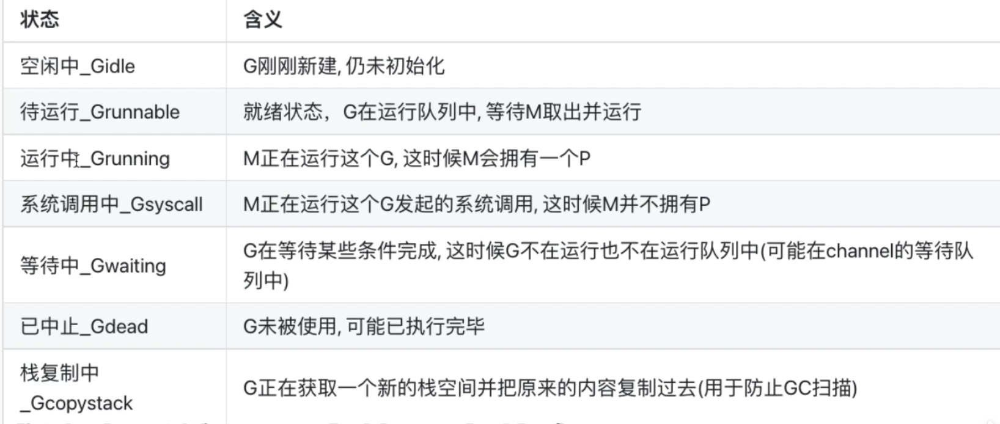
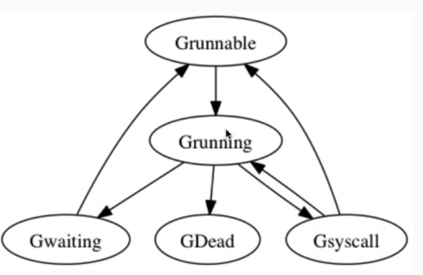
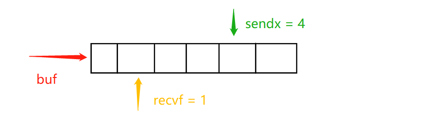

# go基础知识点总结
## 一、程序结构
1. go语言中不存在未初始化的变量。如果初始化被省略，则会使用该类型零值初始化该变量
2. 简短变量声明（:=）使用时，左侧必须有一个未定义的变量。此时，未定义的变量作初始化，已定义的变量作赋值
3. 变量逃逸是指在超出了作用域的变量不能被立刻回收，仍可找到，如下例
```go
var global *int

func f() {
    var x int
    x = 1
    global = &x
}

func g() {
    y := new(int)
    *y = 1
}
// 此时，在f的作用域外，仍可通过global访问到x中的值，我们就称x发生了变量逃逸
// 而y就没有出现变量逃逸现象，作用域外不可达，可直接被回收
```
4. go允许元组赋值，在进行该操作时，会先对右侧进行计算，再统一赋值给左侧。
```go
a ,b = b,a
```
5. 使用type 类型名字 底层类型 可以给类型重命名。重命名的类型相当于另一个类型，不能与不同类型比较大小。
```go
// Package tempconv performs Celsius and Fahrenheit temperature computations.
package tempconv

import "fmt"

type Celsius float64    // 摄氏温度
type Fahrenheit float64 // 华氏温度
// Celsius和Fahrenheit分别对应不同的温度单位。它们虽然有着相同的底层类型float64，但是它们是不同的数据类型

const (
    AbsoluteZeroC Celsius = -273.15 // 绝对零度
    FreezingC     Celsius = 0       // 结冰点温度
    BoilingC      Celsius = 100     // 沸水温度
)

func CToF(c Celsius) Fahrenheit { return Fahrenheit(c*9/5 + 32) }

func FToC(f Fahrenheit) Celsius { return Celsius((f - 32) * 5 / 9) }

func main(){
	var c Celsius
	var f Fahrenheit
	fmt.Println(c == 0)          // "true"
	fmt.Println(f >= 0)          // "true"
	fmt.Println(c == f)          // compile error: type mismatch 类型不同，不能直接比较
	fmt.Println(c == Celsius(f)) // "true"!
}
```
## 二、基础数据类型
6. 整形：
* int 是有符号整型 uint是无符号整型 （int可能是int32也可能是int64,取决于编译器和环境）
* 即使int和int32等价，在进行运算的时候仍需要进行类型转换
* rune等价int32，byte等价uint8
* uintptr 是一个无符号整型，没有指定具体的大小，但足以容纳指针，一般用于底层编程

7. 布尔值不能隐式转换为0/1 需要借助显式if 语句
8. 内置的len函数可以返回一个字符串中的字节数目（不是rune字符数目）,一个汉字占三个字节，索引返回的也是字节的对应的整数值
```go
func main() {
	a := "你好,世界"
	b := "hello,world"
	fmt.Println(len(a))
	for i := 0; i < len(a); i++ {
		fmt.Println(a[i], string(a[i]))
	}
	fmt.Println("-------------------------")
	for i := 0; i < len(b); i++ {
		fmt.Println(b[i], string(b[i]))
	}
}
```
```go
13
228 ä
189 ½
160  
229 å
165 ¥
189 ½
44 ,
228 ä
184 ¸
150 –
231 ç
149 •
140 Œ
-------------------------
104 h
101 e
108 l
108 l
111 o
44 ,
119 w
111 o
114 r
108 l
100 d
```
9. 字符串可以和byte切片相互转换
```go
s := "abc"
b := []byte(s)
s2 := string(b)
```
10. 无类型常量：编译器为这些没有明确基础类型的数字常量提供比基础类型更高精度的算术运算；你可以认为至少有256bit的运算精度。这里有六种未明确类型的常量类型，分别是无类型的布尔型、无类型的整数、无类型的字符、无类型的浮点数、无类型的复数、无类型的字符串。
```go
const (
    _ = 1 << (10 * iota)
    KiB // 1024
    MiB // 1048576
    GiB // 1073741824
    TiB // 1099511627776             (exceeds 1 << 32)
    PiB // 1125899906842624
    EiB // 1152921504606846976
    ZiB // 1180591620717411303424    (exceeds 1 << 64)
    YiB // 1208925819614629174706176
)
//例子中的ZiB和YiB的值已经超出任何Go语言中整数类型能表达的范围，但是它们依然是合法的常量，而且像下面的常量表达式依然有效

fmt.Println(YiB/ZiB) // "1024"
```
## 三、复合数据类型
1. 无法对map中的元素进行取址操作
```go
_ = &ages["bob"] // compile error: cannot take address of map element
```
原因：
* 动态扩容：
Go 的 map 底层是通过哈希表实现的，当 map 需要扩容时，元素的位置可能会发生变化。如果允许对元素取地址，那么在扩容后，这些地址可能会变得无效。
* 值语义：
map 中存储的是值而不是指针。当你通过 key 获取到一个元素时，实际上是获取到该值的一个副本，而不是原始值的引用。
* 内存迁移：
由于 map 的动态扩容特性，元素的内存地址可能会发生变化，这使得对元素取地址变得不安全

**为什么切片扩容仍然能取地址呢？**

* 切片的底层实现：
切片在 Go 中是一个结构体，包含指向底层数组的指针、长度和容量。即使切片扩容，底层数组的地址可能会改变，但切片结构体本身的地址不会变。因此，你可以对切片中的元素取地址，因为这个地址是底层数组中的元素地址，而不是切片结构体的地址。
* map 的底层实现：
map 的底层实现是哈希表，元素存储在多个桶中。当 map 扩容时，元素可能会重新分配到不同的桶中，导致元素的内存地址发生变化。因此，无法对 map 中的元素取地址，因为这些地址在扩容后可能会变得无效。
* 值语义 vs 引用语义：
切片是引用类型，存储的是底层数组的引用，因此可以对其元素取地址。而 map 是值类型，存储的是元素的副本，无法直接对其元素取地址。


2. interface()类型的切片可以包含自身

3. 如果结构体成员名字是以大写字母开头的，那么该成员就是导出的；这是Go语言导出规则决定的。一个结构体可能同时包含导出和未导出的成员。

4. 结构体嵌入不止获得了匿名成员嵌套的成员，还获得了该类型导出的全部方法

## 四、函数
1. 函数签名： 函数的类型被成为函数的签名，如果两个函数的参数列表和返回值一一对应，那么则称他们的函数签名相同。（变量名不影响函数签名）
2. 没有函数体的函数名声往往代表该函数不是由Go语言实现的
3. 如果一个函数所有的返回值都有显式的变量名，那么该函数的return语句可以省略操作数。这称之为bare return。
```go
func abc(i int) (a, b, c int) {
    if i == 1 {
        return  
    }
    a = 0
    b = 1
    c = 2
    return
}
func main() {
    fmt.Println(abc(1)) //0 0 0
    fmt.Println(abc(2)) //0 1 2
}
// 此时每个return都会按照返回值次序返回
// 等价于 return a,b,c
```
4. Go异常处理有别于其他语言的地方：
* 没有传统意义上的异常：
Go语言没有像Java或C++那样的异常处理机制，即没有try、catch和finally这样的关键字。
* Go使用控制流机制（如if和return）处理错误，这使得编码人员能更多的关注错误处理。
5. 函数可以进行赋值操作,但是不同签名的函数不能进行赋值
6. 函数零值是nil并且可以和nil比较，但函数值之间不可以比较
```go
func abc(i int) int {
    return i * i
}
func a() {}
func main() {
    f := abc
    fmt.Println(f(1))
    fmt.Println(f(2))
    fmt.Printf("%T\n", f)
    f = a //Cannot use 'a' (type func()) as the type func(i int) int
}
```
7. 函数闭包：
```go
// squares返回一个匿名函数。
// 该匿名函数每次被调用时都会返回下一个数的平方。
func squares() func() int {
    var x int
    return func() int {
        x++
        return x * x
    }
}
func main() {
    f := squares()
    fmt.Println(f()) // "1"
    fmt.Println(f()) // "4"
    fmt.Println(f()) // "9"
    fmt.Println(f()) // "16"
}
```
原因：
* 作用域链：
在 JavaScript 和 Go 等编程语言中，函数在定义时会捕获其所在的词法作用域（即定义时的作用域），并形成一个作用域链。这个作用域链允许函数在其外部函数执行完毕后，仍然能够访问外部函数中的变量。
* 函数嵌套：
闭包通常出现在函数嵌套的情况下。当一个函数内部定义了另一个函数，并且内部函数引用了外部函数的变量时，就形成了闭包。
* 变量的持久化：
闭包使得外部函数的变量在外部函数执行完毕后仍然存在。这是因为内部函数引用了这些变量，导致它们不会被垃圾回收机制回收。
* 返回函数或作为参数传递：
闭包通常通过返回一个内部函数或将其作为参数传递给其他函数来实现。这使得内部函数可以在外部函数的作用域之外执行，但仍然能够访问外部函数的变量。
8. return并不是原子性的，返回值可以被改变
```go
func squares() (result int) {
	i := 1
	defer func() {
		result++
	}()
	return i
}
func main() {
	fmt.Println(squares())
}

/* 执行顺序
1. 先将 i赋值给 result result = i
2. 再执行defer result++
3. 返回 return result 此时值为2
*/
```
9. panic发生后程序执行了哪写操作：
   1. 程序中断运行
   2. 执该goroutine中的defer函数
   3. 程序崩溃，输出日志信息 

##  七、Gorountines和Channels
### CSP:
是一种现代的并发编程模型
强调通过通信而不是共享内存来协调并发实体。
在Go语言中，这一理念通过goroutines和channels得以实现

**1. 并不需要关闭每一个channel，当没有引用的时候会自动被Go语言的垃圾回收器回收，泄漏的goroutines并不会被自动回收**

**1.5 关闭重复的channel会造成panic异常；关闭nil值的channel也会导致panic异常。关闭channel还会触发广播机制**

**2. 双向channel可以隐式转换单向channel，但是并没有反向转换的语法**

**3. 关闭操作只用于断言不再向channel发送新的数据，所以只能在发送者关闭，在接收端close是一个编译错误，在编译器检测**

**4. channel的缓存队列解耦了接收和发送的goroutine。**

**5. 一个进程中至有一个线程，一个goroutine中至少有一个函数**

**6. Goroutine状态流转:**



**7. Goroutines是一个结构体，真正让goroutine运行起来的是调度器，Go自己实现的一个用户态的调度器（GMP）**

**GMP：**
>M (thread) 和 G (goroutine)，又引进了 P (Processor)。
> 也就也说 M是线程 G是协程，P是处理器


1. 调度器作用是把可运行的G分配到M上
2. M想要运行G，必须先获取P，P中包含了可运行的G队列


---

# go mod 依赖管理
1. go.mod 文件内容
2. go mod 命令行管理
3. go install/get/clean

## 指定项目第三方依赖
```go
module test

go 1.21

require(
	dependency latest
	// 依赖     版本
)
```
## 排除第三方依赖
可能是因为第三方依赖有bug
```go
module test

go 1.21

exclude(
	dependency latest
)
```

## 替换第三方依赖
路径或版本号
```go
module test

go 1.21

replace(
	source latest => target latest
)
```
## 撤回有问题的版本
并不是真正意义上撤回发行版本，只是给特定版本号做标记，尽量减少特定版本的使用（对开发者来说）
```go
module test

go 1.21

retract(
	v1.0.0
	v1.1.0
)
```

## 命令行
* 下载依赖
```
go mod dowload github.com/gin-gonic/gin@v1.9.0
```
* 依赖对齐

download下载的时候只会下载当前的包，使用以来对齐后会下载这个包其他依赖
```
go mod tidy
```
* 备份依赖

将所有依赖备份到vendor文件夹下
```
go mod vendor
```

# 算法

## 数组

### 1. 克隆数组/切片

```go
//数组 —— 默认深拷贝
arr2 := arr1 //深拷贝
arr2 := &arr1 //浅拷贝
//切片 —— 默认浅拷贝，使用下面方法进行深拷贝
//多维数组需要遍历拷贝
target := make([]int,len(source))
copy(target,source)
```

### 2. 取整


```go
math.Ceil(float64) //向上取整
math.Floor(float64) //向下取整
math.Round(float64) //四舍五入
```

### 3.  搜索某个数在数组内的什么位置
```go
sort.SearchInts(arr []int,target int)
//返回第一个target的位置
//若不存在target，则返回target应插入的位置
//arr切片必须是升序排列
```

## 栈
```go
stack := make([]int,0) //初始化 —— 对应类型
stack = append(stack,k) // 添加元素——push
stack = stack[:len(stack)-1] //弹出元素 —— pop
```


## map
```go
scene := make(map[string]int) // 初始化
scene[a] = b // 添加数据
delete(scene,b) // 删除数据
for k, v := range scene { // 遍历数据
    fmt.Println(k, v)
}
```


## 链表
### 1. 定义
```go
type ListNode struct {
	 Val int
     Next *ListNode
  }
```
### 2. 初始化
```go
MyList := &ListNode{}
```

### 2. 删除链表中的特定元素
```go
//删除current的下一个
//让current的下一个等于下一个的下一个
current.Next = current.Next.Next 
```


# 进阶
## 零、Go零散知识点：
1. var，new和make的区别
   - new返回的指针，make返回的是引用类型的值
   

2. for 和 for-range的区别：
   - for 容易导致死循环 ；for-range在进入循环前就设定好了循环次数
   - 1.22版本后，Go修复了for - range中循环变量共享同一地址的bug
```go
//循环次数
	a := []int{1, 2, 3, 4, 5}
	for i := 0; i < len(a); i++ {
		fmt.Println(a[i])
		a = append(a, a[len(a)-1]+1)
	} // 死循环
	
	for _, v := range a {
		fmt.Println(v)
		a = append(a, a[len(a)-1]+1)
	}// 1 2 3 4 5
```
```go
// 1.22 更新：
func main() {
   values := []string{"a", "b", "c"}
   for _, v := range values {
	  //v := v    // 这行代码可以显式的创建新变量，用于旧版本代码输出正确结果
      go func() {
        fmt.Println(v)
      }()
   }//如果Go版本在1.22以下，输出结果为 c c c 
   time.Sleep(1 * time.Second)
}

//或者这样直观观察
func main() {
   values := []string{"a", "b", "c"}
   for _, v := range values {
      fmt.Println(&v)
   }
}
/*
0xc000026070
0xc000026070
0xc000026070
 */
```


## 一、常见数据结构的实现原理：
### 1.Channel 管道
#### 1.1 初始化
可用var声明nil管道；用make初始化管道；

len()： 缓冲区中元素个数， cap()： 缓冲区大小
```go
//变量声明 
var a chan int
//使用make初始化
b := make(chan int)  //不带缓冲区
c := make(chan string,2) // 带缓冲区
```
```go
ch1 := make(chan int) // 0 0
ch2 := make(chan int, 2)// 1 2
ch2 <- 1
fmt.Println(len(ch1), len(ch2), cap(ch1), cap(ch2))
```
#### 1.2 读写操作
用 " <- "来表示数据流向，缓冲区满时写/缓冲区空时读 都会阻塞，直到被其他携程唤醒
```go
a := make(chan int, 3)
a <- 1 //数据写入管道
<-a    //管道读出数据
```
管道默认双向可读写，但也可在创建函数时限制单向读写
```go
func write(ch chan<- int,a int)  {
	ch <- a
	// <- ch  无效运算: <- ch (从仅发送类型 chan<- int 接收)
}

func read(ch <-chan int)  {
	<- ch
	//ch <- 1  无效运算: ch <- 1 (发送到仅接收类型 <-chan int)
}
```
读写值为nil的管道，会永久阻塞，触发死锁
```go
	var ch chan int
	ch <- 1  // fatal error: all goroutines are asleep - deadlock!
	<-ch  	 // fatal error: all goroutines are asleep - deadlock!
```

读写已关闭管道：有缓冲区成功可读缓冲区内容，无缓冲区读零值并返回false；写已关闭管道会触发panic

关闭后，等待队列中的携程全部唤醒，按照上述规则直接返回
```go
ch1 := make(chan int)
ch2 := make(chan int, 2)
go func() {
	ch1 <- 1
}()
ch2 <- 2
close(ch1)
close(ch2)
v1, b1 := <-ch1  //0 false
v2, b2 := <-ch2  //2 true
println(v1, v2, b1, b2)
ch1 <- 1  //panic: send on closed channel
ch2 <- 1  //panic: send on closed channel
```
#### 1.3 实现原理
简单来说，channel底层是通过环形队列来实现其缓冲区的功能。再加上两个等待队列来存储被堵塞的携程。最后加上互斥锁，保证其并发安全
```go
type hchan struct {
qcount   uint           // 队列中数据的总数
dataqsiz uint           // 环形队列的大小
buf      unsafe.Pointer // 指向底层的环形队列
elemsize uint16         // 元素的大小（以字节为单位）
closed   uint32         // 表示通道是否已关闭
elemtype *_type         // 元素的类型（指向类型信息的指针）
sendx    uint           // 写入元素的位置
recvx    uint           // 读取元素的位置
recvq    waitq          // 等待接收的队列（包含等待接收的 goroutine）
sendq    waitq          // 等待发送的队列（包含等待发送的 goroutine）

// lock 保护 hchan 中的所有字段，以及阻塞在这个通道上的 sudogs 中的几个字段。
// 在持有此锁时，不要更改另一个 G 的状态（特别是不要使 G 变为可运行状态），
// 因为这可能会与栈收缩操作发生死锁。
lock mutex //互斥锁
}
```
环形队列是依靠数组实现的（buf指向该数组），实现方法类似双指针：一个指向写入位置（sendx），一个指向读取位置（recvx）

等待队列遵循先进先出，阻塞中的携程会被相反的操作依次唤醒

如果写入时，等待接收队列非空(recvq),那么直接将数据给到等待的携程，不用经过缓冲区

select可以监控单/多个管道内是否有数据，有就将其读出；没有也不会阻塞，直接返回；

select执行顺序是随机的
```go
func main() {
	ch1 := make(chan int)
	ch2 := make(chan int)
	go write(ch1)
	go write(ch2)
	for {
		select {
		case e := <-ch1:
			fmt.Printf("ch1:%d\n", e)
		case e := <-ch2:
			fmt.Printf("ch2:%d\n", e)
		default:
			fmt.Println("none")
			time.Sleep(1 * time.Second)
		}
	}
}
func write(ch chan<- int) {
	for {
		ch <- 1
		time.Sleep(time.Second)
	}
}
```
for-range 读取管道时，管道关闭之后不会继续读取管道内数据；

for 循环读取管道时，管道关闭后，仍会继续读取管道内的数据，返回一堆 零值,false
```go
func main() {
   ch1 := make(chan int)
   go write(ch1)
   for e := range ch1 { // 关闭后不会再从管道读取数据
   	fmt.Print(e)
   }
   //1111
   
   for { // 关闭后仍在从管道读取数据。返回 零值,false
   fmt.Print(<-ch1)
   }
   //11110000000000000000000000000000000000000.....
}
func write(ch chan<- int) {
   for i := 1; i < 5; i++ {
   ch <- 1
   time.Sleep(time.Second)
   }
   close(ch)
}
```

### 2. slice 切片
#### 2.1 初始化
var初始化一个nil切片，不分配内存，（并不是空切片）;make 可以指定长度和容量;字面量可以根据长度自动设定长度

若未指定容量，则容量默认等于长度
```go
func main() { // len cap 值已标注在后面
   var v1 []int				    // 0 0
   v2 := make([]int, 0)		    // 0 0
   v3 := make([]int, 5)		    // 5 5
   v4 := make([]int, 5, 10)	    // 5 10
   v5 := []int{}				// 0 0
   v6 := []int{1, 2, 3, 4, 5}	// 5 5
   v7 := *new([]int)            // 0 0 nil切片，不是空切片
}
```

还可以从数组，切片截取来进行初始化。
-  切片长度根据截取长度定。
-  若从切片截取，容量保持跟原切片一致；从数组截取，容量为数组长度 - 起始截取位置；
- 切片截取时，只考虑容量，不考虑长度；即不超过原数组/切片容量就可以截取
```go
func main() {
   a := [10]int{1, 2, 3, 4, 5}
   s1 := a[1:6]
   s2 := s1[0:9]
   s3 := s1[0:10] //panic: runtime error: slice bounds out of range [:10] with capacity 9
   fmt.Println(len(a), cap(a))
   fmt.Println(len(s1), cap(s1))
   fmt.Println(len(s2), cap(s2))
   /*
   10 10
   5 9
   9 9
    */
}
```
#### 2.2 源代码
切片依托于底层数组实现
```go
type slice struct {
	array unsafe.Pointer // 指向底层数组
	len   int            // 切片长度
	cap   int            // 容量
}
```
由于指向的是底层数组，所以在使用数组/切片创建切片的时候，切片会与原数组/切片共用一部分内存，在对切片进行修改的时候，有可能会将原数据一起修改

但扩容之后，数据会被复制到新切片中，此时底层数组就不一样了，不会发生上述情况
```go
//未发生扩容
func main() {
	a := [10]int{1, 2, 3, 4, 5, 6, 7}
	s1 := a[1:5]
	s2 := s1[0:6]
	s1 = append(s1, 10)
	s2[2] = 100
	fmt.Println(a) 
	fmt.Println(s1)
	fmt.Println(s2)
	/*
	[1 2 3 100 5 10 7 0 0 0]
	[2 3 100 5 10]
	[2 3 100 5 10 7]
	 */
}
```
```go
//发生扩容
func main() {
   a := [10]int{1, 2, 3, 4, 5, 6, 7}
   s1 := a[1:5]
   s2 := s1[0:9]
   s1 = append(s1, 10)
   s2 = append(s2, 10)
   s2[2] = 100
   fmt.Println(a)
   fmt.Println(s1)
   fmt.Println(s2)
}
/*  可以看到修改 100 没有改变原数据
[1 2 3 4 5 10 7 0 0 0]
[2 3 4 5 10]
[2 3 100 5 10 7 0 0 0 10]
 */
```
#### 2.3 拷贝
 - 使用copy(new,old)可以拷贝切片，并且此时两个切片底层数组地址不同。
 - 拷贝时，去两个切片长度的最小值进行拷贝，拷贝过程中不会发生扩容操作。
```go
func main() {
	a := []int{1, 2, 3, 4, 5}
	b := make([]int, 3)
	c := make([]int, 10)
	copy(b, a)
	copy(c, a)
	b[0] = 100
	fmt.Println(a)
	fmt.Println(b)
	fmt.Println(c)
	/*
	[1 2 3 4 5]
	[100 2 3]           //修改不会影响原切片，并且复制不会发生扩容操作
	[1 2 3 4 5 0 0 0 0 0]
	 */
}
```
#### 2.4 扩容
- slice扩容时，会先创建一个大数组，再将原数组数据复制进去，最后再执行append操作。
- 1.18前，大于等于1024,每次扩容25%; 小于1024，每次扩容一倍 
- 1.18后，大于256，扩容后的容量计算公式如下：newcap = oldcap+(oldcap+threshold*3)/4; 小于256，每次扩容一倍
- 过渡更加平滑，避免了2-1.25的突变
- 实际扩容后的容量不严格等于计算结果，还要考虑到内存对齐等问题
```go
//扩容后地址改变
func main() {
	a := make([]int, 1, 2)
	fmt.Println(&a[0])
	a = append(a, 1)        //未发生扩容
	fmt.Println(&a[0])
	a = append(a, 2)        //发生扩容
	fmt.Println(&a[0])
	/*
	0xc00000a0d0
	0xc00000a0d0
	0xc0000101c0        //扩容后的地址发生了改变
	 */
}
```
```go
// 扩容示例
func main() {
	a := make([]int, 256) //第一档
	b := make([]int, 257) //第二档 
	c := make([]int, 512)
	d := make([]int, 1024)
	a = append(a, 1)
	b = append(b, 2)
	c = append(c, 3)
	d = append(d, 4)
	fmt.Println(len(a), cap(a))
	fmt.Println(len(b), cap(b))
	fmt.Println(len(c), cap(c))
	fmt.Println(len(d), cap(d))
}
/*          b扩容后计算结果应为 513.25，向上取整 514 ， 但实际结果为 608 这其中就经历了内存对齐
257 512
258 608
513 848
1025 1536
 */
```
#### 2.5 切片表达式
- 简单表达式[low:high] 表示截取[low,high);low,high均可省略
- 扩展表达式[low:high:capmax] 只可省略low;capmax用来限制新切片容量，避免对high后底层数组的元素进行修改
- 作用于字符串时，生成的结果仍为字符串;扩展表达式不能用于字符串
```go
//扩展表达式
func main() {
	a := [10]int{1, 2, 3, 4, 5, 6, 7, 8, 9, 10}
	b := a[:5]
	b = append(b, 5555)
	c := a[:5:5]        //限制切片容量为5 添加元素就会触发扩容操作，改变底层数组指向
	c = append(c, 6666)
	fmt.Println(a) // [1 2 3 4 5 5555 7 8 9 10]
}
```
```go
func main() {
	a := "lonelysnow"
	b := a[6:]
	//c := a[0:6:6] // invalid operation: 3-index slice of string
	fmt.Println(b)
	fmt.Println(reflect.TypeOf(b))
}
/*
   snow
   string
 */
```
