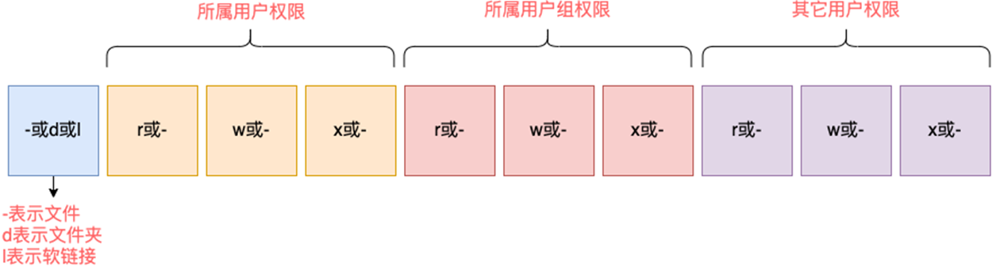

# 初始linux
* 操作系统：操作系统是用户和计算机硬件之间的桥梁，调度和管理计算机硬件进行工作
* 常见操作系统
  * Window
  * Linux
  * MacOS
  * Android
  * ios
  * HarmonyOS
## linux内核
* linux系统组成
  * Linux系统内核——提供最核心的功能：调度CPU，调度内存。调度文件系统，调度网络通讯，调度IO等
  * 系统及应用程序——可供用户快速上手操作系统
* linux内核完全开源
* linux发行版
  * 任何人都可以获得并修改内核，继承系统级程序之后完成封装，就是linux发行版
  * 常用发行版:CentOS Ubuntu
## 远程链接linux系统
### 图形化，命令行
* 对于操作系统的使用，有两种使用形式
  * 图形化界面操作系统：使用操作系统提供的图形化界面，以获得图形化反馈的形式去操作系统
  * 命令行的形式操作系统：使用操作系统提供的各类命令，以获得字符反馈的形式去使用操作系统 

Linux，MacOS，Windows都支持这两种
* 使用Linux系统的时候一般都是使用命令行
  * linux并未重点优化图形化界面，所以图形化界面并不好用
  * 开发中使用命令行效率更高，更加直观，资源占用低，程序更加稳定
 
## 虚拟机快照
在学习阶段无法避免的会损坏Linux操作系统，损坏之后重新安装就非常麻烦

虚拟机快照可以将当前虚拟机的状态保存下来，在之后通过快照恢复虚拟机到保存的状态

---
# Linux基础命令
 * linux只有一个顶级目录，叫根目录 —— /
 * linux用/表示路径

## linux命令入门
在linux中，命令有通用的格式
```command [-options] [parameter] ```
* command：命令本身
* -options:可选，命令的一些选项，可以通过选项控制命令的行为细节
* parameter：可选，命令的参数，多数用于命令的指向目标

## ls命令
ls命令的作用是列出目录下的内容，语法细节如下

```ls [-a -l -h] [linux路径] ``` 
  * 在不使用选项和参数的情况下，会以平铺的形式列出当前工作目录下的内容
  * 当前工作目录默认在用户目录/home（root默认是/root）

  * 选项
    * -a : 列出隐藏文件/文件夹
    * -l : 以列表形式展示内容，并展示更多内容
    * -h : 以易于阅读的形式，列出文件大小，如K、M、G(必须和-l搭配使用)

  * 选项混用，以下命令都一样
    * ls -a -l
    * ls -al
    * ls -la

## cd/pwd命令
* cd命令用于更改工作目录 Change Directory 
  * cd命令无需选项，参数为空表示回默认工作目录
  * ```cd [linux路径]```


* pwd用于打印当前工作目录 —— 仅返回目录名
  * ```pwd```

## 相对路径，绝对路径，特殊路径符
* 相对路径： 开头不需要加/
* 绝对路径： 开头需要加/
* 特殊路径符： 
  * .  当前目录
  * .. 上一级目录
  * ~  默认目录

## mkdir 命令
* 创建新的文件夹/目录
  * ```mkdir [-p] linux路径```
  * 参数必填（一次创建一个层级）
  * -p： 一次性创建多个层级的目录

## touch、cat、more
* touch 创建文件
```touch linux路径```
* cat 查看文件内容
```cat linux路径```
* more 查看文件内容——支持翻页 空格翻页，b上一页，q退出查看
```more linux路径 ```

## cp、mv、rm
* cp用于复制文件/文件夹
  * 语法： ```cp [-r] 参数1 参数2```
  * -r： 可选 复制文件夹时使用，表示递归
  * 参数1： 被复制的路径
  * 参数2： 要复制到的路径 带文件名表示改名
* mv用于移动文件/文件夹
  * 语法： ```mv 参数1 参数2```
  * 参数1 ：被移动的路径
  * 参数2 ：移动到的路径 带文件名表示改名
* rm用于删除文件、文件夹
  * 语法 ```rm [-r -f] 参数1 参数2 ... 参数n```
  * -r 表示删除文件夹
  * -f 强制删除 （只有root会有提示，一般用户用不到-f）
  * 参数1-n：表示要删除的路径，用空格隔开
* 通配符：
  * *可匹配任意内容（包括空）
  * test* 表示以test开头
  * *test 表示以test结尾
  * \*test* 表示任何包含test的内容

## which，find
前面学习的linux命令其实是一个个二进制程序， 可以通过which来查询一系列的系统命令存放在哪里
* which 查询命令程序位置
  * 语法： ```which 要查找的命令```
  * 使用ubuntu并不能查询cd的位置，因为cd是shell内置的一个命令，不是程序
* find 查找指定的文件
  * 指定文件名查找```find 起始路径 -name "被查找文件名" ``` 可使用通配符
  * 指定文件大小查找```find 起始路径 -size +/- -n[KMG]  ```
    * +/-表示大于或小于
    * n表示大小数字
    * KMG表示大小单位

## grep,wc,管道符
* grep通过关键字过滤文件行
  * 语法：```grep [-n] 关键字 文件名```
  * -n 表示在结果中显示匹配的行号
  * 关键字：带有空格或其他特殊符号，建议使用”“ 将关键字包围起来
  * 文件路径: 要过滤内容的文件，**可作为管道符输入端口**
* wc 统计文件的行数、单词数量
  * 语法：```wc [-c -m -l -w] 文件路径```
  * -c：统计bytes数量
  * -m：统计字符数量
  * -l：统计行数
  * -w：统计单词数量
  * 文件路径：被统计的文件，**可作为管道符输入端口**
* 管道符  | 
  * 将右面的命令应用于左面的结果中（左面的结果作为右面的输入）
  * 可嵌套使用
  * 前提是要有输出

## echo，tail，重定向符
* echo 输出语句
  * 语法```echo + 输出内容```
  * 反引号\`` 也叫做飘号 被飘号包围的内容会作为命令执行
* 重定向符 
  * \> 将左侧命令的结果，**覆盖**写到符号右侧指定的文件中
  * \>> 将会左侧命令的结果，**追加**写入符号右侧的文件中
* tail 查看文件尾内容，跟踪文件最新更改
  * 语法： ```tail [-f -num] linux路径```
  * 路径：被跟踪的文件路径
  * -f： 表示持续跟踪
  * -num： 查看尾部多少行 默认十行
  * 可再开一个标签去观察持续跟踪结果

## vi/vim编辑器介绍
是linux中最经典的编辑器，vim是vi的加强版


三种工作模式
* 命令模式：默认模式 
  * 此模式下，不能自由进行文本编辑，所敲的按键编辑器都理解为命令，以命令的驱动执行不同的功能
  * 语法： ```vi/vim 文件路径``` 使用vi/vim均可
  * 如果目标路径表示的文件不存在，则编辑新文件，路径必须存在
* 输入模式
  * 此模式下，可对文件内容自由进行编辑
* 底线命令模式
  * 以：开始，通常用于文件的保存，退出
* 常用命令：


---
# linux用户和权限
多用户管理模式进行权限管理
linxu最大权限用户是：root（超级管理员），拥有最大的系统操作权限
* 普通用户的权限一般在home目录内是不受限的，离开home目录，一般只有只读和执行权限，无修改权限

## su和exit命令
* su ：用户切换帐号的系统命令
  * 语法： ```su [-] [用户名]```
  * -符号可选：表示是否在切换用户后加载环境变量 建议加上
  * 用户名： 表示要切换的用户，用户名也可以省略，默认切换到root
* exit命令回退到上一个用户，也可以使用快捷键 ctrl+d
  * 普通用户切换其他用户需要密码，root切换其他用户则不需要
## sudo命令
* sudo：为普通的命令授权，临时以root身份执行
* 语法:  ```sudo 其他命令```
* 并不是所有用户都有权利使用sudo，需要为普通用户配置sudo认证，没有配置sudo，即使有管理员密码也无法使用sudo命令

##  用户，用户组
linux权限管理有两个级别，用户/用户组
### 用户组管理
* 创建用户组
  * 语法： ```groupadd 用户组名```
* 删除用户组
  * 语法： ```groupdel 用户组名``` 
### 用户管理：
* 创建用户
  * 语法： ```useradd [-g -d] 用户名```
  * -g：指定用户的组，不指定会创建同名组并自动加入，指定组需保证组存在，若已有同名组则必须使用-g
  * -d：指定用户HOME路径，不指定则默认在/home/用户名
* 删除用户
  * 语法： ```userdel [-r] 用户名```
  * -r ： 删除用户的HOME目录
* 查看用户归属组：
  * 语法： ```id [用户名]```
  * 默认为当前用户
* 修改用户归属组：
  * 语法： ```usermod -aG <group> <user>```
  * 将指定用户加入到指定组
  * 语法： ```deluser <user> <group>```
  * 将指定用户移除用户组
### getent
* 查看当前系统中有哪些用户、用户组
* 语法:  ```getent passwd/group```
* passwd结果： 用户名：密码（X）：用户ID：组ID：描述信息（无用）：HOME路径：终端
* group结果： 组名称：组认证（X）：组ID

## 查看权限控制
通过ls -l 可以通过列表查看详细信息，并显示权限细节，可将信息大体分为三部分


* 序号1 ，表示所属用户权限
  * 
  * -表示无权限 
  * r——读(eg:ls,cat等)，w——写(eg:touch,mkdir,rm等)，x——执行(cd进入)
* 序号2 ，表示所属用户组权限
* 序号3 ，表示其他用户权限

## chmod 修改权限
* 可以使用chmod命令修改文件/文件夹的权限——只有文件、文件夹的所属用户才能修改
  * 语法： ```chmod [-R] 权限 文件或文件夹```
  * -R，对文件内的全部内容应用同样的操作
  * eg： ```chmod u=rwx,g=rx,o=x hello.txt``` 即可将文件修改为: rwxr-x--x
    * u表示user，g表示group，o表示other
* 权限快捷表示
  * r=4,w=2,x=1
  * 751 -> rwxr-x--x
## chown 修改文件/文件夹归属
* 可以使用chown修改文件/文件夹所属的用户/用户组
* **普通用户无法操作，只有root用户可以操作**
  * 语法： ```chowm [-R] [用户] [：] [用户组] 文件或文件夹```
  * ':' ：用于分割用户和用户组
  * eg： ```chown root:root hello.txt``` 归属修改为root用户，root用户组
  * eg： ```chown :root hello.txt``` 归属修改为root用户组
  * eg： ```chown root hello.txt``` 归属修改为root

---
# linux实用操作
## 各类小技巧
|    按键     | 作用             |
|:---------:|:---------------|
| ctrl + C  | 强制停止           |
| ctrl + D  | 退出或登出（不能退出vim） |
|  history  | 查找历史记录         |
|   !+字符    | 自动配置执行匹配前缀的命令  |
| ctrl + R  | 输入内容匹配历史命令     |
| ctrl + A  | 光标跳到命令开头       |
| ctrl + E  | 光标跳到命令结尾       |
| ctrl + -> | 光标向右跳一个单词      |
| ctrl + <- | 光标向左跳一个单词      |
| ctrl + L  | 清屏（clear）      |


## 软件安装
###  yam命令
* RPM包软件管理器，用于自动化安装配置linux软件，并可以自动解决依赖问题。
  * 语法： ```yum [-y] [install | remove | search] 软件名称```
  * -y：自动确认，无需手动确认安装或卸载过程
  * install ： 安装
  * remove ： 卸载
  * search ： 搜索
* 需要root权限，可以su切换或者sudo提权
* 需要联网 
### apt命令（Ubuntu）
* 与centOS的yum命令相同，用于软件安装[Ubuntu的软件包是 .deb文件]
  * 语法： ```apt [-y] [install | remove | search] 软件名称```
  * 用法一样，需要联网

## systemctl命令
* 大部分软件都支持systemctl命令控制：启动、停止、开机自启
* 能被systemctl管理的软件一般称之为：服务
  * 语法： ```systemctl start/stop/status/enable/disable 服务名
  * 启动/关闭/查看状态/开机自启/关闭开机自启 

系统内置了很多服务 如：
* NetworkManager: 主网络服务
* network ： 副网络服务
* firewalld ： 防火墙服务
* sshd，ssh服务 
* 有部分软件安装后不会自动集成到systemctl中，我们可以手动添加

## 软链接
* 可以将文件，文件夹链接到其他位置，类似快捷方式
  * 语法： ```ln -s 参数1 参数2```
  * -s： 创建软链接
  * 参数1 ： 被链接的文件/文件夹
  * 参数2 ： 链接目的地
* 层数不宜过多

## 日期/时区
### date命令：
* 通过date命令可以在命令行中查看系统时间
  * 语法： data [-d] [+格式化字符串]
  * -d ： 按照给定的字符串显示时间，一般用于日期计算，可加减 年月日时分秒
  * 格式化字符串： 通过特定的字符串标记，来控制显示的日期格式
  * %Y:年
  * %y:年份后两位数字
  * %m：月份
  * %d：日
  * %H：小时
  * %M：分钟
  * %S：秒
  * %s：时间戳 
* 使用root权限可修改时区，执行如下代码：
```
rm -f etc/localtime
sudo ln -s /usr/share/zoneinfo/Asia/Shanghai /etc/localtime
```

### ntp程序
* 自动校准系统时间，可设为开机自启
### ip地址/主机名
虚拟机的ip地址是通过DHCP服务获取的，每次重启设备都会获取一次，可能导致ip地址频繁变更
* 如何查看ip地址：
  * ip add / ip address
  * ifconfig —— 这个命令使用不了的可以执行```yum -y install net-tools```，之后就可以用了 
* 特殊IP地址：
  * 127.0.0.1 本地回环ip， 代指本机
  * 0.0.0.0 特殊IP
    * 可代指本机
    * 可在端口绑定中确定绑定关系
    * 在ip地址限制中，表示所有ip
* 主机名
  * 如何查看： hostname
  * 如何修改： hostnamectl set-hostname 主机名 （需root）
### 域名解析
访问地址时先去本机的hosts文件下找，看看有没有对应的记录，找不到再去公共的DNS服务器查询（114.114.114.114 8.8.8.8）

## 网络传输
### ping命令
可以通过ip命令，检查指定的网络服务器是否为可联通状态
* 语法： ```ping [-c num] ip或主机名```
* -c ： 检查的次数，不使用-c将进行无限次检查

### wget命令：
非交互的文件下载器，可以在命令行内下载网络文件
* 语法： ```wget [-b] url```
* -b : 可选： 后台下载，会将工作日志写入到当前的工作目录的wget-log文件
* url：下载链接
 
### curl命令：
* 语法： ```curl [-o] url```
* -o，用于下载文件，当url是下载链接时，可以使用此选项保存文件
* url：要发起请求的网络地址

### 端口
是设备和外界通讯交流的出入口，。端口可分为物理端口和虚拟端口
* 物理端口： 又可称之为接口，是可见的端口，USB，RJ45，HDMI
* 虚拟端口： 是指计算机内部的端口，是不可见的是用来操作系统和外部进行交互使用的

linux可以支持65535个端口，这六万个端口分为三类使用
* 公认端口： 1-1023，通常用于一些系统内置或知名程序的使用，ssh22端口，https的443端口，非特殊需要，不占用这里面端口
* 注册端口：1024-49151 通常可以随意使用。用于松散的绑定一些程序/服务
* 动态端口： 49152-65535 通常不会固定绑定程序，而是当程序对外进行网络链接时，用于临时使用

### 查看端口占用：
可以使用linux命令去查看端口的占用情况
* nmap —— 查看指定ip的端口占用情况
    * 安装： ```yum -y install nmap```
    * 语法： nmap + ip地址
* netstat 查看端口的占用情况
  * 安装： ```yum -y install net-tools```
  * 语法： ```netstat -anp | grep 端口号```

## 进程管理
程序在操作系统中，是被操作系统所管理的，每个程序在运行的时候都会被系统注册为一个**进程**，并分配进程ID（进程号）
* ### ps命令 查看linux系统中的进程信息
  * 语法： ```ps [-e -f]```
  * -e： 列出全部的进程
  * -f： 以完全格式化的形式展示信息（展示全部信息）
  * 一般来说，固定使用就是 ps -ef 列出全部信息
* 信息从左到右： 
  * UID： 进程所属的用户id
  * PID： 进程的进程号
  * PPID： 进程的父ID
  * C： 此进程的CPU占用率（百分比）
  * STIME： 进程的启动时间
  * TTY： 启动此进程的终端序号，如显示？，表示非终端启动
  * TIME： 进程占用CPU的时间
  * CMD： 进程的启动路径或启动命令
* 查看指定进程
  * 可以使用管道符配合grep筛选
  * eg ： ```ps -ef | grep 筛选的信息```
* ### kill 关闭指定进程： 
  * 语法： ```kill [-9] 进程ID```
  * -9： 表示强制关闭进程。不使用此选项会向进程发送信号要求其关闭，但是是否关闭进程看自身的处理机制
## 主机状态
### 查看系统资源占用
* top 查看cpu，内存的使用情况，默认每五秒刷新一次
  * 语法 ```top```
  * 退出： ```ctrl + C 或者 单击 q```
* top命令详解： 
  * 第一行： top：命令名称，当前系统时间，启动了X分钟，X个用户登录，load：1、5、15分钟负载
  * 第二行： Tasks：X个进程，X个进程子在运行，X个进程睡眠，X个停止进程，X个僵尸进程
  * 第三行： CPU使用率：**us：用户CPU使用率，sy：系统CPU使用率**，ni：高优先级进程占用CPU时间百分比，id：空闲CPU率，wa：IO等待CPU占用率，hi：CPU硬件中断率，si：CPU软件中断率，st：强制等待占用CPU率
  * 第四行： Kib Mem：物理内存，total：总量，free：空闲，used：使用，buff/cache：buff和cache占用
  * 第五行： KibSwap：虚拟内存（交换空间），total：总量，free：空闲，used：使用，buff/cache：buff和cache占用
* 详细信息：
  * PID：进程id
  * USER：进程所属用户
  * PR：进程优先级，越小越高
  * NI：负值表示高优先级，正表示低优先级
  * VIRT：进程使用虚拟内存，单位KB
  * RES：进程使用物理内存，单位KB
  * SHR：进程使用共享内存，单位KB
  * S：进程状态（S休眠，R运行，Z僵死状态，N负数优先级，I空闲状态）
  * %CPU：进程占用CPU率
  * %MEM：进程占用内存率
  * TIME+：进程使用CPU时间总计，单位10毫秒
  * COMMAND：进程的命令或名称或程序文件路径


* top命令选项


* top交互式选项


### 查看磁盘监控
* df 使用df命令可以查看磁盘使用情况
  * 语法： ```df [-h]``` 
  * -h: 更人性化的单位显示
* iostat 查看CPU，磁盘的相关信息
  * 安装： ```yum install -y sysstat```
  * 语法： ```iostat [-x] [num1] [num2]```
  * -x:显示更多信息
  * num1： 刷新间隔 num2： 刷新几次
  * 该设备每秒的传输次数。"一次传输"意思是"一次I/O请求"。多个逻辑请求可能会被合并为"一次I/O请求"。"一次传输"请求的大小是未知的。
* 详细信息：
  * rrqm/s：	每秒这个设备相关的读取请求有多少被Merge了
    * （当系统调用需要读取数据的时候，VFS将请求发到各个FS，如果FS发现不同的读取请求读取的是相同Block的数据，FS会将这个请求合并Merge, 提高IO利用率, 避免重复调用）；
  * wrqm/s：	每秒这个设备相关的写入请求有多少被Merge了。
  * rsec/s：	每秒读取的扇区数；sectors
  * wsec/：	每秒写入的扇区数。
  * **rKB/s：	每秒发送到设备的读取请求数**
  * **wKB/s：	每秒发送到设备的写入请求数**
  * avgrq-sz 	平均请求扇区的大小
  * avgqu-sz 	平均请求队列的长度。毫无疑问，队列长度越短越好。    
  * await：  	每一个IO请求的处理的平均时间（单位是微秒毫秒）。
  * svctm    	表示平均每次设备I/O操作的服务时间（以毫秒为单位）
  * **%util： 	磁盘利用率**
### 网络状态监控
* sar 查看网络相关统计
  * sar非常复杂，这里仅使用简单的统计网络
  * 语法： ```sar -n DEV num1 num2```
  * -n : 查看网络，DEV表示查看网络端口
  * num1： 刷新间隔（不填就一次结束） num2 ： 不填不限次数


* 信息解读：
  * IFACE 本地网卡接口的名称
  * rxpck/s 每秒钟接受的数据包
  * txpck/s 每秒钟发送的数据包
  * **rxKB/S 每秒钟接受的数据包大小，单位为KB**
  * **txKB/S 每秒钟发送的数据包大小，单位为KB**
  * rxcmp/s 每秒钟接受的压缩数据包
  * txcmp/s 每秒钟发送的压缩包
  * rxmcst/s 每秒钟接收的多播数据包
  
## 环境变量：
环境变量是操作系统在运行时记录的一些关键性信息，用以辅助程序运行
* env —— 查看系统中记录的环境变量
### 环境变量： path
无论在哪里，都能执行cd这个程序，就是借助path这个项目的值来做到的，当执行任何命令时，都会按照顺序从上述路径中搜索执行程序的本体


### $符号：
$用于取到环境变量记录的值
* 语法： ```echo ${环境变量名}[想输出的其他内容]```
* 如果只想输出环境变量的内容，可不加{}

### 设置环境变量：
* export 临时设置环境变量
  * 语法： ```export 变量名=变量值```
* 永久生效：
  * 针对当前用户生效，配置在当前用户的：	~/.bashrc文件中
  * 针对所有用户生效，配置在系统的：	/etc/profile文件中
  * 并通过语法：source 配置文件，进行立刻生效，或重新登录FinalShell生效
* 追加自定义path
  * ```PATH=$PATH:追加路径```
  * 这样就保证了不会覆盖掉原本的path路径

## 安装和下载
### rz，sz命令
除了使用FinalShell的下方窗体进行文件传输外，也可以通过rz，sz命令进行文件传输。
rz，sz命令需要安装
* 安装： ```yum -y install lrzsz```
* 但是不推荐用这个命令，速度较慢，建议使用finalshell窗体拖拽实现
* rz上传 sz下载

## 压缩，解压
### tar命令
* .tar，称之为tarball，归档文件，将文件简单的组装到一个.tar文件内，并没有太多的压缩，仅仅是简单的封装
* .gz 常见为.tar.gz gzip格式压缩文件，即使用gzip压缩算法将文件压缩到一个文件内，可以极大的减小压缩后的体积
* 语法： ```tar [-c -v -x -f -z -C] 参数1 参数2 ... 参数N```
  * -c ： 创建压缩文件，用于压缩模式
  * -v ： 显示压缩，解压过程，用于查看进度
  * -x ： 解压模式
  * -f ： 要创建的文件，或者要解压的文件，必须处于所有选项中的最后一个
  * -z ： gzip模式，不使用-z就是普通的tarball格式
  * -C ： 选择解压的目的地，用于解压模式
* eg：  ```tar -cvf test.tar 1.txt 2.txt 3.txt``` —— 将123压缩到test.tar 文件中
* eg：  ```tar -zcvf test.tar.gz 1.txt 2.txt 3.txt``` —— 将123压缩到test.tar.gz 文件中，使用gzip模式
* eg：  ```tar -xvf test.rar``` 解压test.rar到当前目录
* eg：  ```tar -zxvf test.tar.gz -c /home``` 将.gz文件解压到指定目录

### zip命令
* 压缩语法: ```zip [-r] 参数1 参数2 ... 参数N``` 
  * -r：被压缩的包含文件夹的时候，需要使用-r选项，和rm，cp的-r效果一致
  * eg： ```zip -r test.zip a b.txt c.txt``` 将文件夹a，文件bc压缩到test.zip中
* 解压语法： ```unzip [-d] 参数```
  * -d ： 指定要解压去的位置，同-c
  * 参数，被解压的zip文件
  * eg： ```unzip test.zip -d /home``` 将test解压到指定目录
* 解压同名文件会覆盖，注意保存