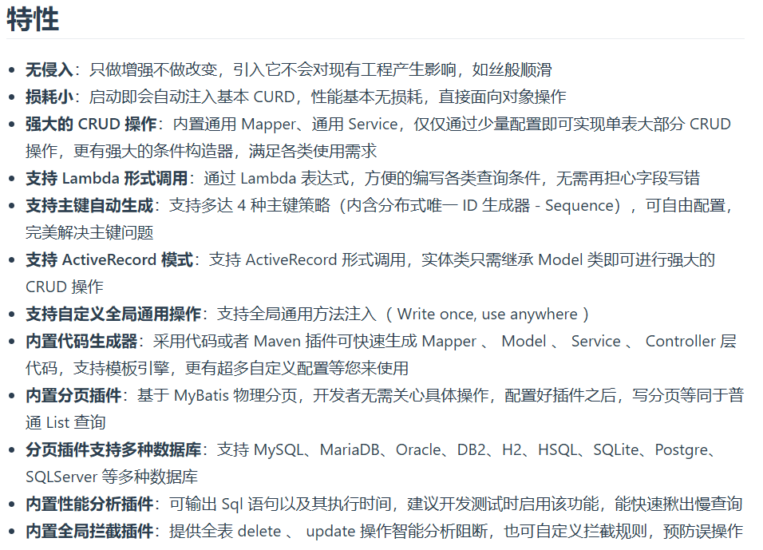
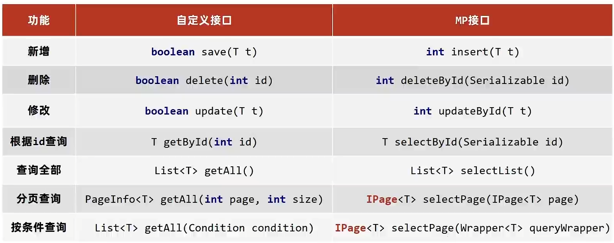

# 初识MyBatisPlus
## 入门案例
SpringBoot整合MyBatis（复习）
1. 创建SpringBoot工程
2. 勾选使用的到的技术
3. 设置dataSource相关属性（JDBC参数）
4. 定义数据层接口映射配置

SpringBoot整合MyBatisPlus(简称mp)
1. 创建新模块，选择Spring初始化，并配置模块相关基础信息（SQL中只需要勾选MySQL Driver）
2. **手动添加mp起步依赖**
3. 设置jdbc参数
4. 制作实体类和表结构
5. **定义数据接口，继承BaseMapper<>**

* pom.xml
  * 由于MyBaits的起步依赖中mybatis-spring的版本过低，所以在SpringBoot3.X的版本上无法运行
  * 所以需要再配置一个高版本的mybatis-spring来解决maven的依赖传递问题
```xml
<dependencies>
        <dependency>
            <groupId>com.baomidou</groupId>
            <artifactId>mybatis-plus-boot-starter</artifactId>
            <version>3.5.4</version>
        </dependency>

        <dependency>
            <groupId>com.alibaba</groupId>
            <artifactId>druid</artifactId>
            <version>1.2.20</version>
        </dependency>

        <dependency>
            <groupId>org.mybatis</groupId>
            <artifactId>mybatis-spring</artifactId>
            <version>3.0.3</version>
        </dependency>
    </dependencies>
```

* UserDao
```java
@Mapper
public interface UserDao extends BaseMapper<ABC> { }
```

* domain/ABC
  * 如果表名和实体类名不一样，可以加上@TableName("对应表名")的注解
```java
@TableName("user")
public class ABC {
    private Long id;
    private String name;
    private String password;
    private Integer age;
    private String tel;
    //......
    //略去getter setter方法以及toString方法
}
```

* application.yml
```yaml
spring:
  datasource:
    type: com.alibaba.druid.pool.DruidDataSource
    driver-class-name: com.mysql.cj.jdbc.Driver
    url: jdbc:mysql://localhost:3306/mybatisplus_db
    username: root
    password: 123456
```

* 测试类
```java
@SpringBootTest
class MyBatisPlusApplicationTests {

    @Autowired
    private UserDao userDao;

    @Test
    void testGetAll() {
        List<ABC> Users = userDao.selectList(null);
        System.out.println(Users);
    }
}
```

## MyBatisPlus概述
* MyBatisPlus(简称MP)是基于MyBatis框架基础上开发的增强型工具，旨在简化开发，提高效率
* 国内组织开发的技术

 

---
# 标准数据层开发
## mp提供的接口

## Lombok
* lombok,一个Java类库，提供了一组注解，简化POJO实体类的开发
* 常用@Data:注解在类上，提供get、set、equals、hashCode、canEqual、toString、无参构造方法，**没有有参构造**

* pom.xml
```xml
<dependency>
   <groupId>org.projectlombok</groupId>
   <artifactId>lombok</artifactId>
   <scope>provided</scope>
</dependency>
```

* 实体类
```java
@Data
//如果表名和实体类名不一样，可以加上@TableName("对应表名")的注解
@TableName("user")
public class User {
    private Long id;
    private String name;
    private String password;
    private Integer age;
    private String tel;
}
```

## MP分页查询功能
1. 设置分页拦截器作为Spring管理的bean
2. 执行分页查询
3. 开启日志（可选）

* config/Mpconfig
```java
@Configuration
public class Mpconfig {
    @Bean
    public MybatisPlusInterceptor mybatisPlusInterceptor(){
        //1.定义mp拦截器
        MybatisPlusInterceptor mybatisPlusInterceptor = new MybatisPlusInterceptor();
        //2.在mp拦截器中添加具体拦截器
        mybatisPlusInterceptor.addInnerInterceptor(new PaginationInnerInterceptor());
        return mybatisPlusInterceptor;
    }
}
```

* 测试类
```java
@SpringBootTest
class MyBatisPlusApplicationTests {

  @Autowired
  private UserDao userDao;
  @Test
  void testGetByPage(){
    IPage page = new Page(1,5);
    userDao.selectPage(page,null);
    System.out.println("当前页码数："+ page.getCurrent());
    System.out.println("每页显示数："+ page.getSize());
    System.out.println("一共多少页："+ page.getPages());
    System.out.println("一共多少条："+ page.getTotal());
    System.out.println("数据："+ page.getRecords());
  }
}
```

* application.yml —— 开启日志（可选）
```yaml
mybatis-plus:
  configuration:
    log-impl: org.apache.ibatis.logging.stdout.StdOutImpl
```
---
# DQL编程控制
## 条件查询
### 四种常见查询方式

* lambda的格式，也就是方法引用，有点类似匿名函数
  * User::getId 也就是 (User) -> user.getId()
  * 作用等同于 new User().getId()
```java
@SpringBootTest
class MyBatisPlusApplicationTests {

  @Autowired
  private UserDao userDao;
  @Test
  void testGetAll() {
    //方式一：按条件查询 
//        QueryWrapper qw = new QueryWrapper<>();
//        qw.lt("age",300);
//        List<User> Users = userDao.selectList(qw);
//        System.out.println(Users);

    //方式二：lambda格式按条件查询
//        QueryWrapper<User> qw = new QueryWrapper<>();
//        qw.lambda().lt(User::getAge,200);
//        List<User> Users = userDao.selectList(qw);
//        System.out.println(Users);


    //方式三：lambda格式按条件查询(推荐)
//        LambdaQueryWrapper<User> qw = new LambdaQueryWrapper<>();
//        qw.lt(User::getAge,200);
//        List<User> Users = userDao.selectList(qw);
//        System.out.println(Users);

    //方式四： lambda格式按条件查询(推荐)
    LambdaQueryWrapper<User> qw = new LambdaQueryWrapper<>();
//        qw.lt(User::getAge,600).gt(User::getAge,300); //可以链式编程
    qw.gt(User::getAge, 600).or().lt(User::getAge, 100); //可以链式编程
    List<User> Users = userDao.selectList(qw);
    System.out.println(Users);
  }
}
```

###  空值处理
* 条件参数控制
```java
@SpringBootTest
class MyBatisPlusApplicationTests {

  @Autowired
  private UserDao userDao;

  @Test
  void testGetAll() {
      UserQuery uq = new UserQuery();
//        uq.setAge(100);
//        uq.setAge2(300);
    //null判定,先判断条件是否为true
    LambdaQueryWrapper<User> qw = new LambdaQueryWrapper<>();
    qw.gt(null != uq.getAge(), User::getAge, uq.getAge());
    qw.lt(null != uq.getAge2(), User::getAge, uq.getAge2());
    List<User> Users = userDao.selectList(qw);
    System.out.println(Users);
  }
}
```

## 查询投影
* 查询包含模型类中部分属性
* 查询结果包含模型类中未定义的属性

```java
// 包含模型类中部分属性，不是所有的聚合函数都支持
@SpringBootTest
class MyBatisPlusApplicationTests {
    
  @Autowired
  private UserDao userDao;

  @Test
  void testGetAll() {
    QueryWrapper<User>  qw = new QueryWrapper<>();
    qw.select("count(*) count");
    List<Map<String, Object>> Users = userDao.selectMaps(qw);
    System.out.println(Users);
  }
}
```

```java
// 包含模型类中中未定义的属性
@SpringBootTest
class MyBatisPlusApplicationTests {
    
  @Autowired
  private UserDao userDao;

  @Test
  void testGetAll() {
    QueryWrapper<User>  qw = new QueryWrapper<>();
    qw.select("count(*) count,age");
    qw.groupBy("age");
    List<Map<String, Object>> Users = userDao.selectMaps(qw);
    System.out.println(Users);
  }
}
```

## 查询条件
* eq(字段,"值") 等值匹配
* le ge  between 闭区间匹配[]
* like 模糊匹配
* ... 更多可去官方文档查询

## 字段映射与表名映射
问题一： 表字段与编码属性设计不同步

问题二： 编码中添加了数据库中未定义的属性

问题三： 采用默认查询开放了更多的字段查看权限
* @TableField
  * 类型： 属性注解
  * 位置： 模型类属性定义上方
  * 作用： 设置当前属性对应的数据库表中的字段关系
  * 属性： 
    * value —— 设置数据库的字段名称
    * exist —— 设置属性在数据库表中字段是否存在，默认为true。此属性无法与value合并使用
    * select —— 设置属性是否参与查询，此属性与select映射不冲突
* @TableName
  * 类型： 类注释
  * 位置： 模型类定义上方
  * 作用： 设置当前类对应于数据库标关系
  * 属性：
    * value —— 表名称
```java
@TableName("user")
public class User {
  private Long id;
  private String name;
  @TableField(value = "password",select = false)
  private String pwd;
  private Integer age;
  private String tel;
  @TableField(exist = false)
  private Integer online;
}
```

---

# DML编程控制
## 基础增删语句
```java
@SpringBootTest
class MyBatisPlusApplicationTests {

  @Autowired
  private UserDao userDao;

  @Test
  void add() {
    User user = new User();
    user.setName("LonelySnow");
    user.setPwd("LonelySnow");
    user.setAge(123);
    user.setTel("LonelySnow");
    userDao.insert(user);
  }

  @Test
  void delete() {
    LambdaQueryWrapper<User> qw = new LambdaQueryWrapper<>();
    qw.eq(User::getName, "lonelysnow");
    userDao.delete(qw);
  }
}

```

## id生成策略控制
* AUTO(0) —— 使用数据库自增ID策略生成
* NONE(1) —— 不设置ID生成策略
* INPUT(2) —— 用户手动输入ID
* ASSIGN_ID(3) —— 雪花算法生成ID（可兼容数值型与字符串型）
* ASSIGN_UUID(4) —— 以UUID生成算法作为ID生成策略

雪花算法 —— 生成一个64位的二进制数（必须用long型装）
* 占位符（第一位）：0
* 时间戳（41位）
* 机器码（5+5位）
* 序列号（12位）

配置文件统一添加
```yaml
mybatis-plus:
  global-config:
    db-config:
      #id策略
      id-type: assign_id
      #所有实体类名前拼接前缀，相当于@TableName
      table-prefix: tbl_
```

## 逻辑删除
* 删除操作业务问题： 业务数据从数据库中丢失
* 逻辑删除： 为数据设置是否可用字段，删除时设置字段为不可用状态，数据保留在数据库中

逻辑删除步骤
1. 数据库表中添加逻辑删除标记字段
2. 实体类中添加对应的字段，并设置当前字段为逻辑删除字段
3. 配置逻辑删除字面值

```java
//单独设置
@TableName("user")
public class User {
//    @TableId(type = IdType.AUTO)
    private Long id;
    private String name;
    @TableField(value = "password",select = false)
    private String pwd;
    private Integer age;
    private String tel;
    @TableLogic(value = "0",delval = "1")
    private Integer deleted;
}
```

```yaml
//配置通用配置
mybatis-plus:
  global-config:
    db-config:
      logic-delete-field: deleted
      logic-not-delete-value: 0
      logic-delete-value: 1
```

## 乐观锁
* 业务并发现象带来的问题： 秒杀

乐观锁添加步骤
1. 数据库表中添加锁标记字段
2. 实体类中添加对应字段，并设定当前字段为逻辑删除标记字段 
3. 配置乐观锁拦截器实现锁机制对应的动态SQL语句拼装
4. 
```java
@Configuration
public class Mpconfig {

    @Bean
    public MybatisPlusInterceptor mybatisPlusInterceptor(){
        //1.定义mp拦截器
        MybatisPlusInterceptor mybatisPlusInterceptor = new MybatisPlusInterceptor();
        //2.在mp拦截器中添加具体拦截器
        mybatisPlusInterceptor.addInnerInterceptor(new PaginationInnerInterceptor());
        //添加乐观锁拦截器
        mybatisPlusInterceptor.addInnerInterceptor(new OptimisticLockerInnerInterceptor());
        return mybatisPlusInterceptor;
    }
}
```
```java
@SpringBootTest
class MyBatisPlusApplicationTests {

    @Autowired
    private UserDao userDao;

    @Test
    void update(){
        //1. 修改前先查询要修改的数据
        User user = userDao.selectById(2L);
        //2.将想要修改的属性值传进去
        user.setName("snow");
        userDao.updateById(user);  
    }
}
```
