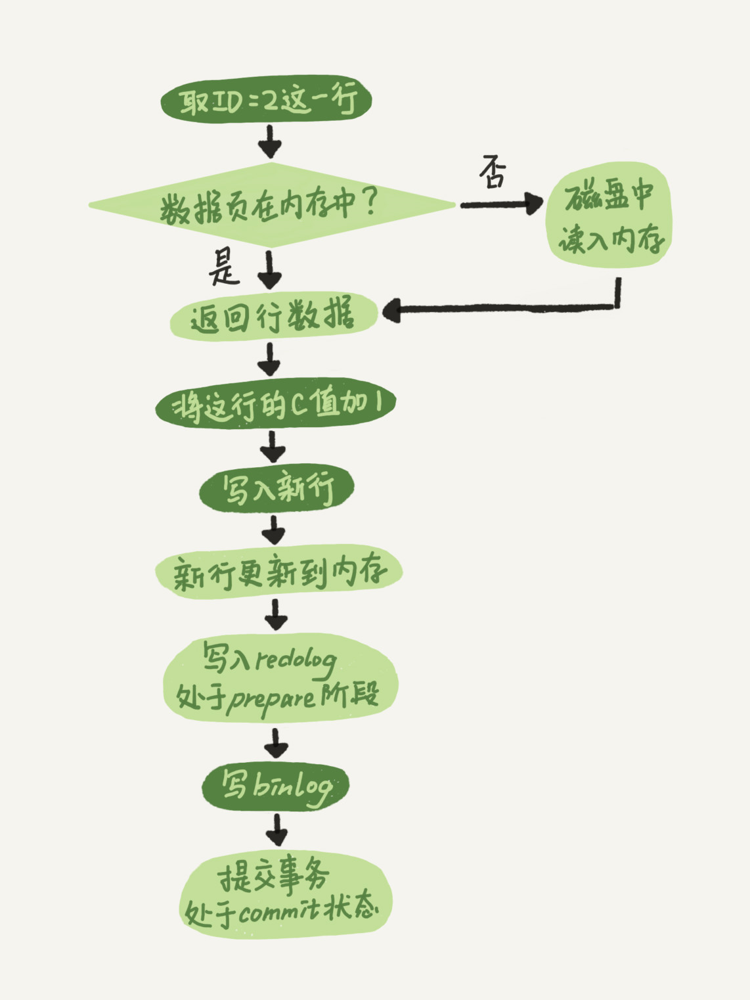
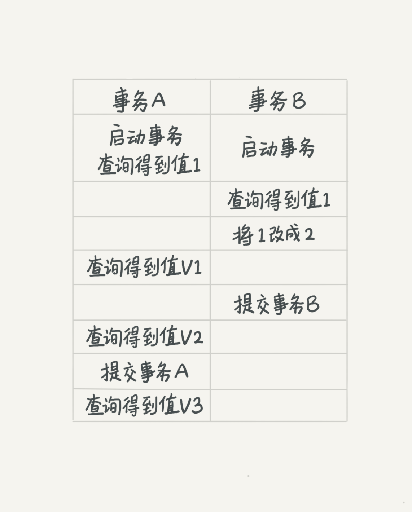

## 1. 一条SQL的查询语句是怎样执行的
1. 首先通过**链接器**，验证MySQL账号密码，与服务器建立链接
2. （MySQL 8.0之前）查询缓存，如果命中则直接返回结果，如果没有结果，进入下一步
3. 再通过**分析器**对SQL进行“词法分析”和“语法分析”，词法分析识别关键字，语法分析判断语法是否正确
4. 之后**优化器**会根据实际情况选择一个最优的执行方案
5. 最后**执行器**判断对这个表是否有权限，没有权限就返回一个错误，有权限就使用存储引擎的接口进行查询

## 2. 一条SQL的更新语句是怎样执行的
依旧是需要走一遍查询语句的全过程，不过没有了查询缓存这步，如果MySQL低于8.0，则会在执行的时候清空之前缓存的全部数据

## 3.如果SQL语句的 关键字出错/查询条件出错 分别在哪个阶段判断
* 如果SQL语句的关键字错误，在分析器的语法分析时就可以检测出来
* 而如果时查询条件的错误，则要需要在优化器查询索引的时候检测出来了

## 4. redolog 的两阶段提交
1. 先写redolog 并标记为prepare
2. 写入binlog
3. 提交事务，并标记为commit

两阶段提交根本上是为了让redolog 和 binlog的状态保持逻辑上的一致性，解决了主从数据库不一致的问题

redolog的出现，赋予了数据库crash-safe的能力

## 5. 如果不使用两阶段提交呢？
不使用两阶段提交会导致数据库的状态和用日志恢复出来的不一致，无论是先执行redolog还是先执行binlog都无法避免这个情况

### 原因？
1. 先执行redolog还是先执行binlog，在写入redolog后mysql异常重启，可以通过redolog重写数据；
但由于binlog中并没有这条记录，所以恢复数据库的时候就会差生差异，与原库中的值不同
2. 先执行binlog再执行redolog，写入binlog后mysql异常重启，由于redolog中没有信息，无法通过redolog重写数据；
但是binlog中有这条日志，恢复数据库的时候就会恢复到修改后的值，与原库中的值不同。

## 6. 事务隔离级别：
* 读未提交，事务还没提交，他的变更就能被其他事务看到了
* 读已提交，事务只有在提交之后，才能被其他事务看到
* 可重复读，事务在执行过程中，看到的数据总是跟启动时一致
* 串行化，对同一行数据在读写时会加锁，当读写锁冲突时，后访问的事务必须等待前一个事务执行完成才能继续执行

举个例子：
现在启动A，B两个事务，A将一条数据由0改为1，此时B进行查询
如果此时隔离级别是读未提交 ： 结果就是1，更新的结果被立即读到
隔离级别是读已提交：结果是0，因为事务还没有提交，不会获取到更新后的值

此时事务A进行提交，事务B再次进行查询
隔离级别为读已提交：结果是1，因为事务A已经提交，可以获取到更新后的值了
隔离级别为可重复读：结果仍然是0，因为要保证数据总是跟事务启动时一致，事务B启动时数据为0，在整个事务B中读取到的数据都会是0

而如果隔离级别为串行化，那么A事务一旦进行读写操作，事务B在进行操作的时候就会阻塞，直到事务A提交

## 7. 事务ACID
* 原子性
* 一致性
* 隔离性
* 持久性
