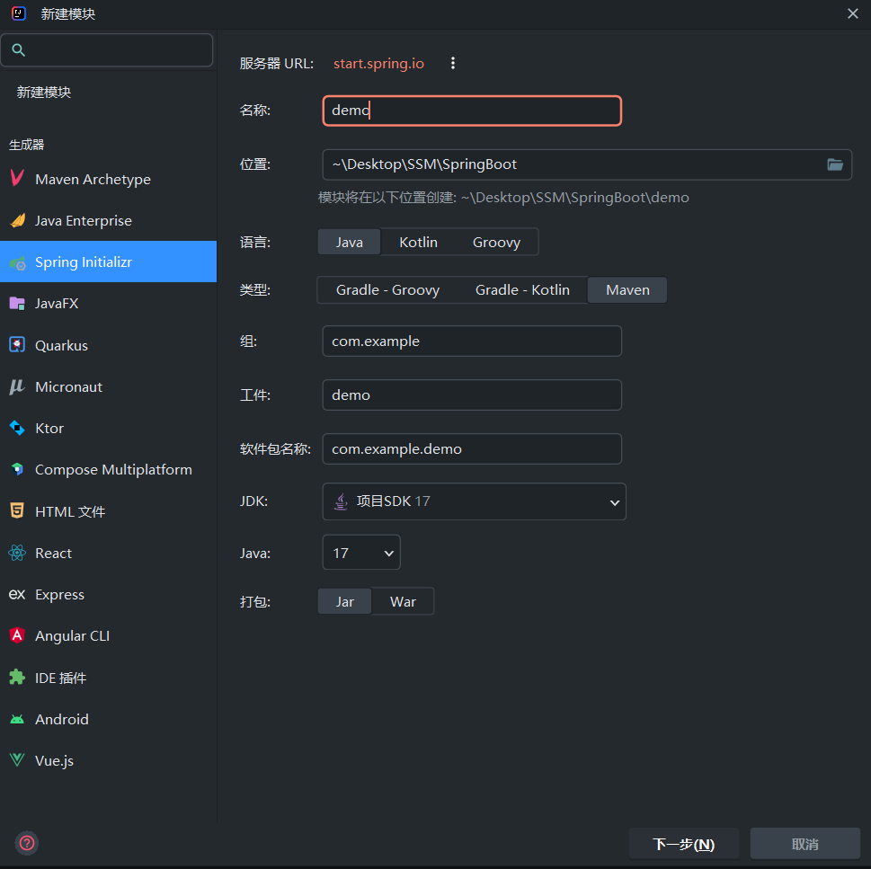
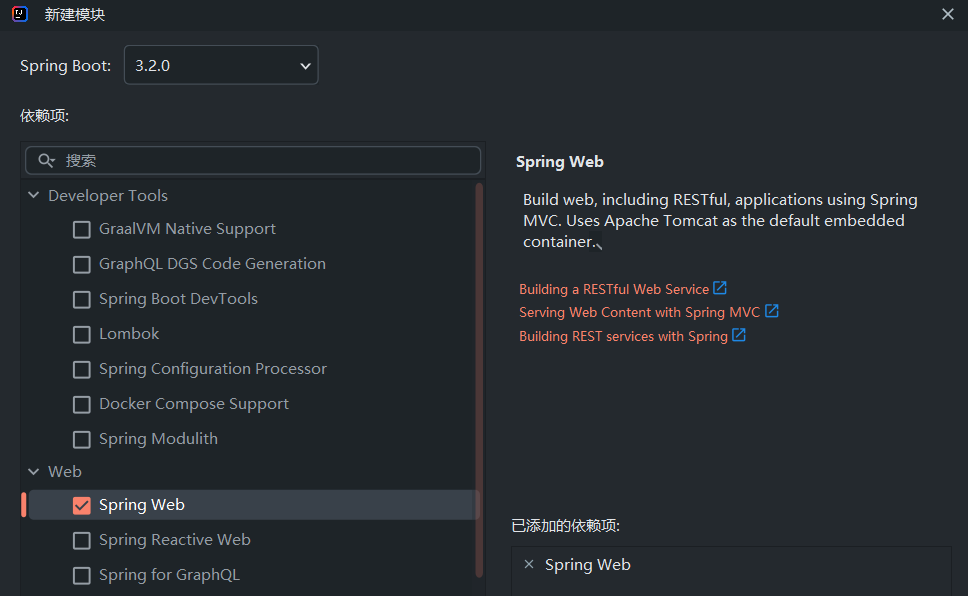
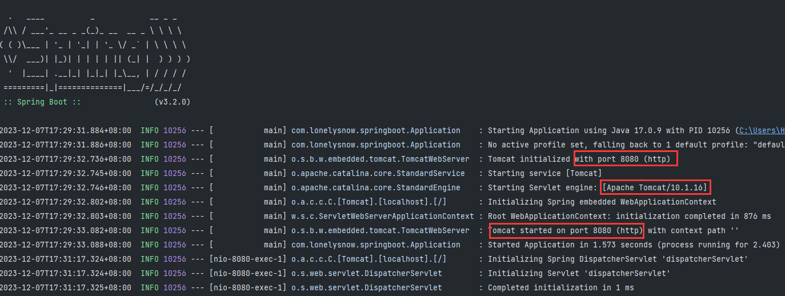
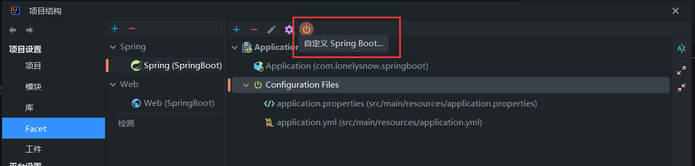
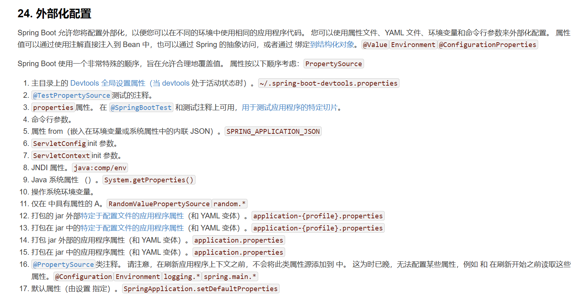
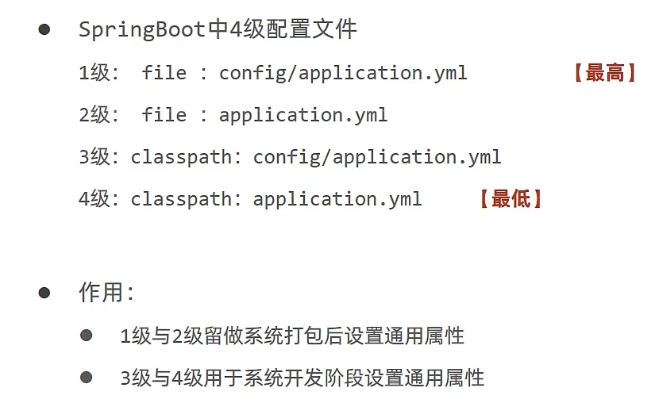
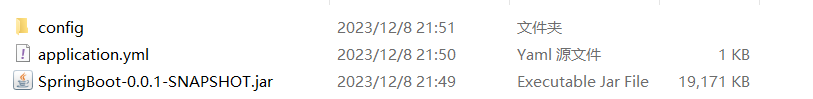
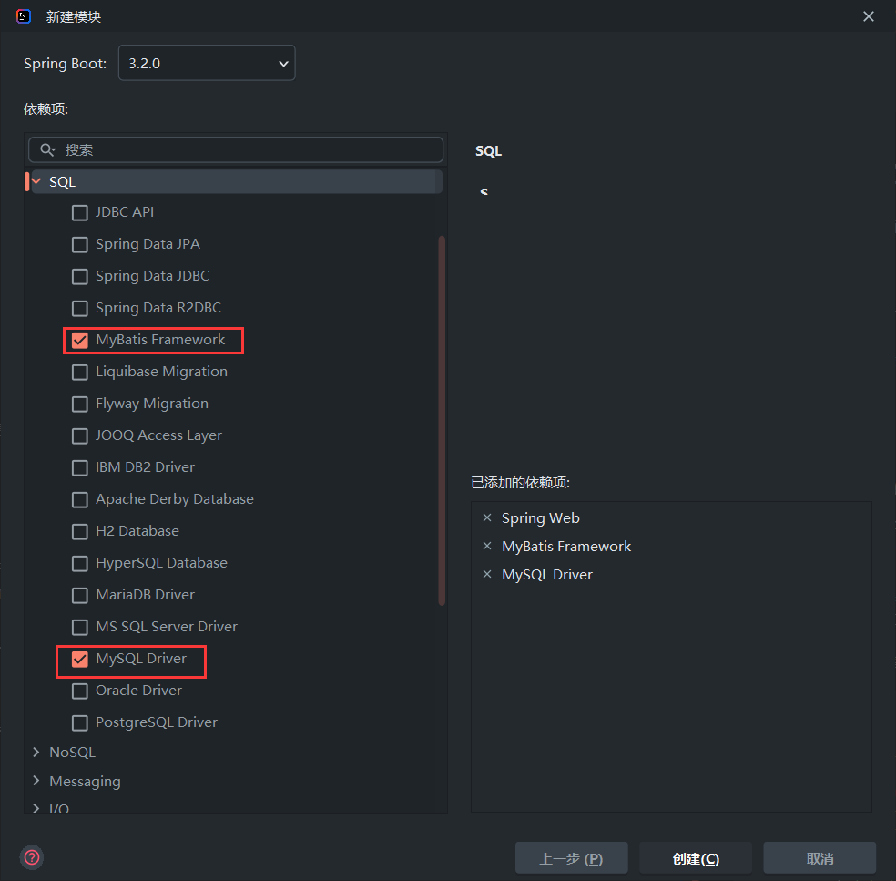

# SpringBoot简介 

* 原生开发SpringMVC程序的过程
    1. 导入坐标
    2. Web核心配置类
    3. SpringMvc配置类
    4. Controller类实现功能
## 入门案例
### 创建SpringBoots入门程序步骤
  1. 创建新模块，选择Spring Initializr 并配置相关的基础信息——注意对应的JDK版本 
     * SpringBoot3.X 强制要求JDK版本不低于17
     * JDK8 可使用SpringBoot2.X
  2. 勾选SpringWeb
  3. 开发控制器controller类
  4. 运行自动生成的Application类
     * 可以看见Tomcat的端口号和版本信息
  




### Spring程序与SpringBoot程序对比
* pom文件中的坐标
  * Spring ： 手动添加
  * Springboot： 勾选添加
* Web配置类
  * Spring ： 手动添加
  * Springboot： 无
* Spring/SpringMvc配置类
  * Spring ： 手动添加
  * Springboot： 无
* pom文件中的坐标
  * Spring ： 手动添加
  * Springboot： 勾选添加

**注：开发Spring程序需要确保联网且能够加载到陈虚谷框架结构，不使用idea可以直接去官网(start.spring.io)创建项目**

### Spring项目快速启动

1. 对SpringBoot项目进行打包（执行Maven构建指令package）
2. 执行启动指令 ```java -jar 名称.jar```
   * jar包的运行需要maven插件，打包时注意
```xml
    <build>
        <plugins>
            <plugin>
                <groupId>org.springframework.boot</groupId>
                <artifactId>spring-boot-maven-plugin</artifactId>
            </plugin>
        </plugins>
    </build>
```

---
## SpringBoot概述
* SpringBoot是由Pivotal团队提供的全新框架，其设计目的是用来简化Spring应用的初始搭建以及开发的过程
* Spring程序缺点
  * 配置繁琐
  * 依赖设置繁琐
* SpringBoot程序优点
  * 自动配置
  * 起步依赖（简化依赖配置）
  * 辅助功能（内置服务器，...）
* ### 起步依赖
  * starter
    * SpringBoot中常见的项目名称，定义了当前项目使用的所有坐标，以达到**减少依赖配置**的目的
  * parent
    * 所有Spring项目都要继承的项目，定义了若干个坐标的版本号（依赖管理，而非依赖），以达到**减少依赖冲突**的目的
  * 实际开发
    * 使用任意坐标时，仅书写GAV中的G和A，V由SpringBoot提供
    * 如发生坐标错误，再指定version（小心版本冲突）
```xml
<?xml version="1.0" encoding="UTF-8"?>
<project xmlns="http://maven.apache.org/POM/4.0.0" xmlns:xsi="http://www.w3.org/2001/XMLSchema-instance"
         xsi:schemaLocation="http://maven.apache.org/POM/4.0.0 https://maven.apache.org/xsd/maven-4.0.0.xsd">
    <modelVersion>4.0.0</modelVersion>
    <parent>
        <groupId>org.springframework.boot</groupId>
        <artifactId>spring-boot-starter-parent</artifactId>
        <version>3.2.0</version>
    </parent>
  
    <groupId>com.Lonelysnow</groupId>
    <artifactId>SpringBoot</artifactId>
    <version>0.0.1-SNAPSHOT</version>
  
    <dependencies>
        <dependency>
            <groupId>org.springframework.boot</groupId>
            <artifactId>spring-boot-starter-web</artifactId>
        </dependency>
    </dependencies>
</project>
```

* ### 引导类
```java
@SpringBootApplication
public class Application {
    public static void main(String[] args) {
        SpringApplication.run(Application.class, args);
    }
}
```
* SpringBoot在创建项目时，采用jar的打包方式
* SpringBoot的引导类时项目的入口，运行main方法就可以启动项目
* 变更起步依赖项非常便捷
```xml
<?xml version="1.0" encoding="UTF-8"?>
<project xmlns="http://maven.apache.org/POM/4.0.0" xmlns:xsi="http://www.w3.org/2001/XMLSchema-instance"
         xsi:schemaLocation="http://maven.apache.org/POM/4.0.0 https://maven.apache.org/xsd/maven-4.0.0.xsd">
    <modelVersion>4.0.0</modelVersion>
    <parent>
        <groupId>org.springframework.boot</groupId>
        <artifactId>spring-boot-starter-parent</artifactId>
        <version>3.2.0</version>
    </parent>
    <groupId>com.Lonelysnow</groupId>
    <artifactId>SpringBoot</artifactId>
    <version>0.0.1-SNAPSHOT</version>
  
    <dependencies>
        <dependency>
            <groupId>org.springframework.boot</groupId>
            <artifactId>spring-boot-starter-web</artifactId>
            <exclusions>
                <exclusion>
                    <groupId>org.springframework.boot</groupId>
                    <artifactId>spring-boot-starter-tomcat</artifactId>
                </exclusion><!--排除tomcat服务器-->
            </exclusions>
        </dependency>

        <dependency>
            <groupId>org.springframework.boot</groupId><!--改用jetty服务器-->
            <artifactId>spring-boot-starter-jetty</artifactId>
        </dependency>
    </dependencies>
  
</project>
```

---

# 基础配置
## 配置格式
SpringBoot提供了多种属性的配置方式
* application.properties
```properties
server.port=80
```
* application.yml
```yaml
server:
  port: 80
```
* application.yaml
```yaml
server:
  port: 80
```
如果yaml/yml文件没有自动补全，代码提示，可以在项目结构中将文件添加到项目的配置文件中



* Springboot配置文件的加载顺序
  * application.properties
  * application.yml
  * application.yaml

## yaml
yaml(YAML Ain't Markup Language),一种数据序列化格式
* ### 优点
  * 容易阅读
  * 容易与脚本语言交互
  * 以数据为核心，重数据轻格式
* ### YAML文件拓展名
  * .yml (主流)
  * .yaml
* ### 语法规则：
  * 大小写敏感
  * 属性层级关系使用多行描述，每行结尾使用冒号结束
  * 使用缩进表示层级关系，同层级左侧对齐，只允许使用空格（不允许使用tab）
  * 属性值前面加空格（属性名与属性值之间使用冒号+空格作为分割）
  * \# 表示注释 

**核心格式：冒号后加空格**
* 数组数据在数据书写位置的下方使用减号作为数据的开始符号，每行书写一个数据，减号与数据间空格分割
```yaml
likes:
  - a
  - b
  - c
  - d
```

### 读取数据的方式
* 使用@Value读取单个数据，属性名引用方式 ${一级属性名.二级属性名}
* 封装全部数据到Environment对象
* 使用自定义对象封装数据
  * 关联数据时，自定义类中要使用  @ConfigurationProperties(prefix = "目标数据名")

BookController —— 调用
```java
@RestController
@RequestMapping("/books")
public class BookController {

  @Value("${testA}")
  private int testA;
  @Value("${enterprise.C[0]}")
  private String C;
  @Value("${enterprise.C[1]}")
  private String A;
  
  @Autowired
  private Environment environment;

  @Autowired
  private Enterprise enterprise;

  @GetMapping
  public String get() {
    System.out.println(environment);
    System.out.println("________________________________________");
    System.out.println(enterprise);
    return "hello world";
  }
}
```
domain/Enterprise —— 自定义对象
```java
@Component
@ConfigurationProperties(prefix = "enterprise") 
public class Enterprise {
    private String A;
    private Integer B;
    private String D;
    private String[] C;

//  ......
//  getter setter方法省略
}
```

application.yml
```yaml
testA: 100

enterprise:
  A: AAA
  B: 200
  D: BBB
  C:
    - 前端
    - aa
    - ba
    - ca
    - da
```

## 多环境开发
### 多环境配置
* yaml/yml格式 —— 不区分环境名称的先后顺序
```yaml
spring:
  profiles:
    active: dev

---
server:
  port: 80
spring:
  config:
    activate:
      on-profile: dev
---

server:
  port: 81
spring:
  config:
    activate:
      on-profile: pro
---

server:
  port: 82
spring:
  config:
    activate:
      on-profile: test
```

* application.properties —— 主配置文件
```properties
#设定需要的运行环境
spring.profiles.active=dev
```
* application-dev.properties —— 新建配置文件，专用来更改环境
```properties
server.port=82
```
### 多环境启动命令
* cmd带参数启动SpringBoot
  * 先执行clean操作清空上一次的操作影响
  * 在执行package将程序封包
  * 在jar包路径下运行cmd

``` java -jar SpringBoot-0.0.1-SNAPSHOT.jar --spring.profiles.active=XXX(环境名称)```

``` java -jar SpringBoot-0.0.1-SNAPSHOT.jar --spring.profiles.active=dev --server.port=8081``` 可运行

``` java -jar SpringBoot-0.0.1-SNAPSHOT.jar --spring.profiles.active=dev --server.port=8081 --server.port=8082``` 会报错

注意事项：
1. 如果yml/properties文件中有汉字的话，打包会报错，可以先去idea中修改文件编码格式为UTF-8
2. 如果输入的配置指令错误，程序也不会报错，会跳过当前这条配置，如果未读到有效配置，则使用默认配置
3. 多条配置重复时会报错

* Spring配置文件加载顺序，优先级从高到低



### 与Maven共同进行版本控制

1. Maven中设置多环境属性
2. SpringBoot中引用Maven属性

* pom.xml
```xml
<project>
<!--  无关配置已略去-->
    <profiles>
        <profile>
            <id>dev</id>
            <properties>
                <profile.active>dev</profile.active>
            </properties>
        </profile>
        <profile>
            <id>pro</id>
            <properties>
                <profile.active>pro</profile.active>
            </properties>
            <activation>
                <activeByDefault>true</activeByDefault>
            </activation>
        </profile>
        <profile>
            <id>test</id>
            <properties>
                <profile.active>test</profile.active>
            </properties>
        </profile>
    </profiles>


    <build>
        <plugins>
<!--            允许外部文件读取pom中的属性-->
            <plugin>
                <groupId>org.apache.maven.plugins </groupId>
                <artifactId>maven-resources-plugin</artifactId>
                <version>3.3.1</version>
                <configuration>
                    <useDefaultDelimiters>true</useDefaultDelimiters>
                </configuration>
            </plugin>
        </plugins>
    </build>

</project>
```

* application.yml
```yaml
spring:
  profiles:
    active: ${profile.active}

---
server:
  port: 80
spring:
  config:
    activate:
      on-profile: dev
---

server:
  port: 81
spring:
  config:
    activate:
      on-profile: pro
---

server:
  port: 82
spring:
  config:
    activate:
      on-profile: test
```

## 配置文件分类


* 1，2级的路径是在jar包的目录下（**跟着jar包走**）
* 3，4级是写项目的时候配置的



# 整合第三方技术
## SpringBoot整合JUnit
```java
@SpringBootTest
class ApplicationTests {
    @Autowired
    private BookService bookService;

    @Test
     public void save(){
        bookService.save();
    }

}
```
 
## Spring整合mybatis

### Spring 整合mybatis（复习）
  * SpringConfig
    * 导入JdbcConfig
    * 导入MybatisConfig
  * JdbcConfig
    * 定义数据源（加载properties配置项：driver，url，username，password）
  * MyBatisConfig
    * 定义SqlSessionFactoryBean
    * 定义映射配置
### SpringBoot整合MyBatis
  1. 创建新模块，选择Spring初始化，并配置模块相关基础信息
  2. 选择当前模块所需要使用的技术集（MyBatis，Mysql）
  3. 设置数据源参数
  4. 定义数据层接口与映射配置(记得引入Mapper坐标)
  5. 测试类中注入dao接口，测试功能


* pom.xml(勾选数据集之后会多出两个坐标) 
```xml
<dependencies>
        <dependency>
            <groupId>mysql</groupId>
            <artifactId>mysql-connector-java</artifactId>
            <scope>runtime</scope>
            <version>8.0.33</version>
        </dependency>
        <dependency>
            <groupId>org.mybatis.spring.boot</groupId>
            <artifactId>mybatis-spring-boot-starter</artifactId>
            <version>3.0.3</version>
        </dependency>
</dependencies>
```
* application.yml
```yaml
spring:
  profiles:
    active: ${profile.active}
  datasource:
    driver-class-name: com.mysql.cj.jdbc.Driver
    url: jdbc:mysql://localhost:3306/ssm_db
    username: root
    password: 123456
```
* BookDao(让Spring能扫描到，并为其添加自动代理)
```java
@Mapper
public interface BookDao {
   @Select("select * from tbl_book where id = ${id}")
   Book getById(Integer id);
}
```
* ApplicationTests
```java
@SpringBootTest
class ApplicationTests {

    @Autowired
    private BookDao bookDao;
    
    @Test
    public void testById(){
        Book book =  bookDao.getById(3);
        System.out.println(book);
    }
}
```

## 基于SpringBoot的SSM整合
1. pom.xml
   * **配置起步依赖，必要的资源坐标（druid）**
   * druid的作用：能够重复利用数据库连接（有些类似线程池），提高对请求的响应时间和服务器的性能。
2. application.yml
   * 设置数据源，端口等
3. 配置类
   * **全部删除**
4. dao
   * **设置Mapper**
5. 测试类
6. 页面：
   * 放在resource目录下的static目录中