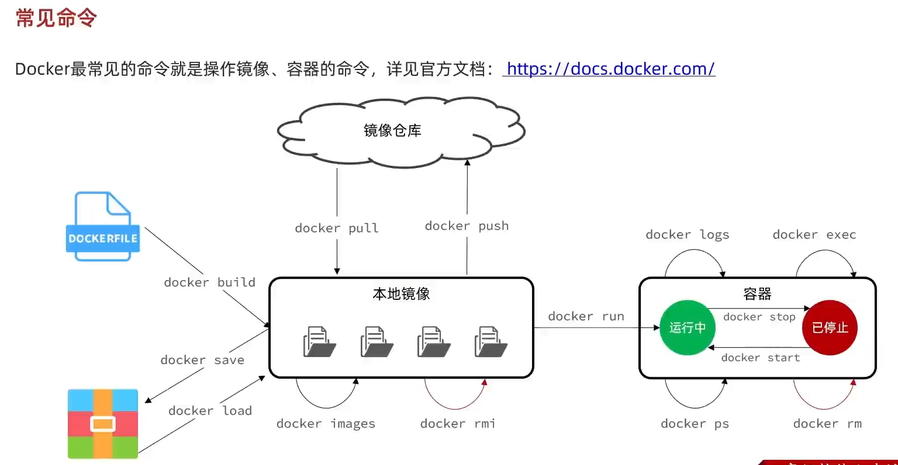
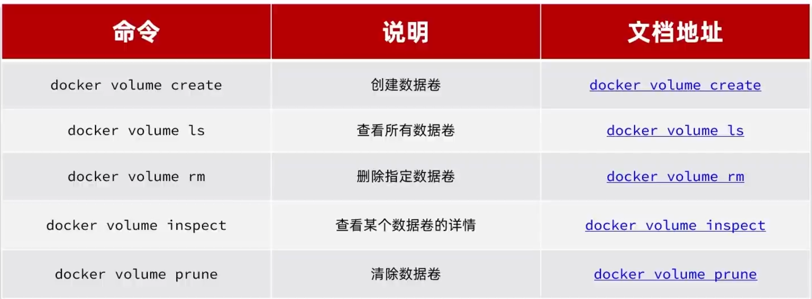
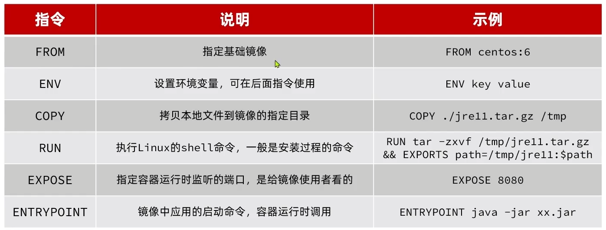
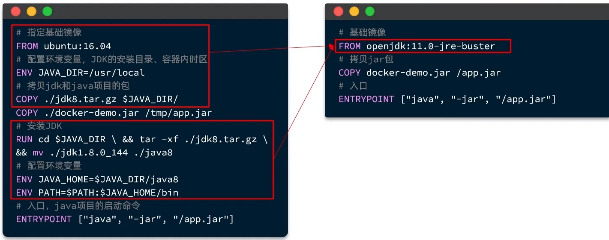
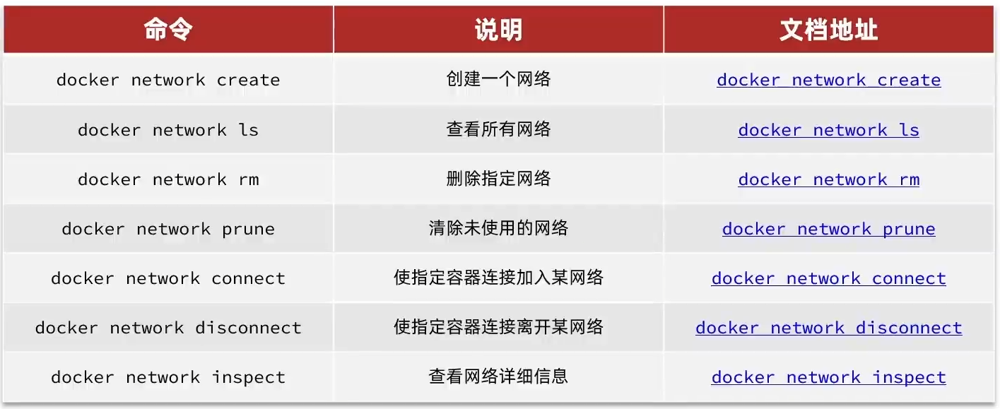

# docker 
## 一、docker入门
### 安装
1. 卸载旧版
首先如果系统中已经存在旧的Docker，则先卸载：
```
yum remove docker \
docker-client \
docker-client-latest \
docker-common \
docker-latest \
docker-latest-logrotate \
docker-logrotate \
docker-engine
```

2. 配置Docker的yum库
首先要安装一个yum工具

```
yum install -y yum-utils
```

安装成功后，执行命令，配置Docker的yum源：

```
sudo yum-config-manager --add-repo http://mirrors.aliyun.com/docker-ce/linux/centos/docker-ce.repo
```

3. 安装Docker
最后，执行命令，安装Docker
```
yum install -y docker-ce docker-ce-cli containerd.io docker-buildx-plugin docker-compose-plugin
```
4. 启动和校验
```
# 启动Docker
systemctl start docker

# 停止Docker
systemctl stop docker

# 重启
systemctl restart docker

# 设置开机自启
systemctl enable docker

# 执行docker ps命令，如果不报错，说明安装启动成功
docker ps
```
### 镜像和容器
当我们利用docker安装应用时，Docker会自动搜索并下载应用镜像（image）。
镜像不仅包括应用本身，还包含应用运行所需要的环境、配置、系统函数库。

docker会在运行镜像时创建一个隔离环境，称为容器（container）。

**镜像仓库**： 存储和管理镜像的平台，Docker hub

### 常用命令

## 二、docker 数据卷
案例一：利用Nginx部署静态资源

需求：
* 创建Nginx容器，修改nginx容器内的html目录下的index.html文件，查看变化
* 将静态资源部署到nginx的html目录

**几乎所有的镜像文件都仅维持自身最小运行需求，不包含其他内容，如vi，ll等，所以修改内部数据变得非常困难**

### 定义
数据卷（volume）是一个虚拟目录，是容器内目录和宿主机目录之间映射的桥梁

宿主机目录的映射路径是固定的：/var/lib/docker/volumes/



* 在执行docker run命令的时候，使用 -v 数据卷：容器内目录 可以完成数据卷挂载
* 当创建容器时，如果挂在了数据卷且数据卷不存在，会自动创建数据卷 

### 镜像结构
**层(Layer)**：

添加安装包，依赖，配置等，每次操作都形成新的一层

**基础镜像（BaseImage）**：

应用依赖的系统函数库，环境，配置，文件等

**入口（Entrypoint）**：

镜像运行入口，一般是程序启动的脚本和参数

### Dockerfile
**DockerFile**是一个文本文件，其中包含一个个**指令（Instruction）**，用指令来说明要执行什么操作来构建镜像。
将来Docker可以根据Dockerfile帮我们构建镜像。常用指令如下：



eg：


如果编写好了DockerFile，可以使用下面的命令来构建镜像

```shell
docker build -t myImage:1.0 .
```

-t : 给镜像起名，是repository：tag的格式，不指定tag时，默认为latest
 
. : 是指定Dockerfile所在目录，如果就在当前目录，则指定为"."

## 网络
默认情况下，所有容器都是以bridge方式连接到docker的一个虚拟网桥上：

加入自定义网络的容器才可以通过容器名相互访问，Docker的网络操作如下：

**在同一自定义网桥下的两个容器可以相互通信**
 

# 部署项目
DockerCompose
通过一个单独的docker-compose.yml模板文件（YAML格式）来定义一组相关联的应用容器，帮助我们实现**多个相互关联的Docker容器的快速部署**
