# Redis 入门概述
## Redis是什么：
Remote Dictionary Server（远程字典服务器）
使用ANSIC语言编写遵守BSD协议，**是一个高性能的Key-Value数据库**，提供了丰富的数据结构，例如String、Hash、List、Set、SortedSet等等。数据是存在内存中的，同时Redis支持事务、持久化、LUA脚本、发布/订阅、缓存淘汰、流技术等多种功能，提供了主从模式、Redis Sentinel和Redis Cluster集群架构方案

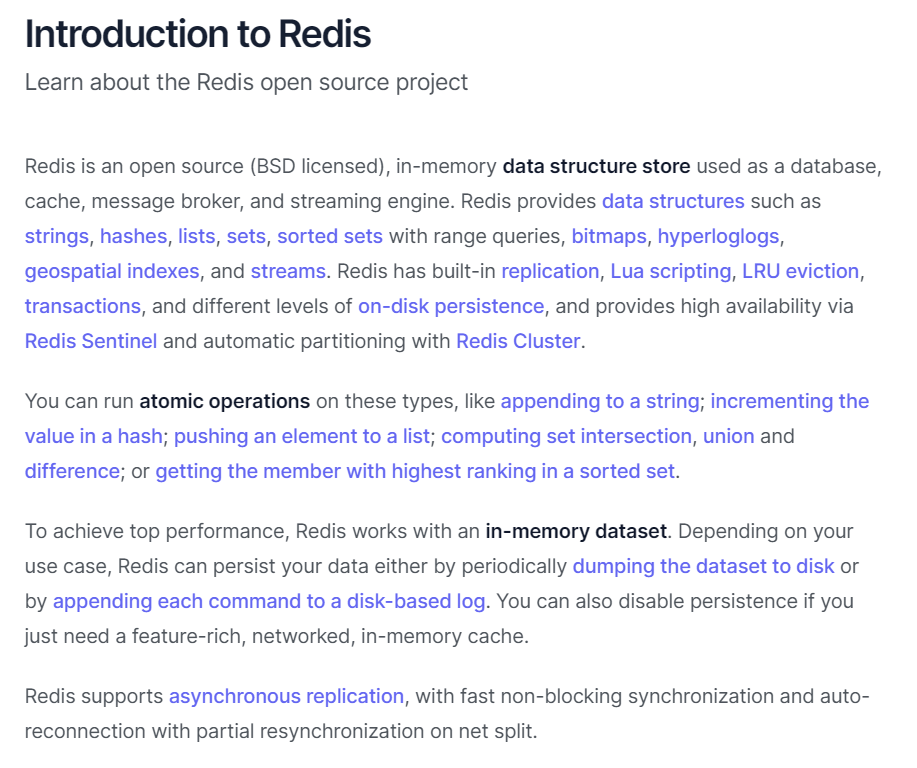
## 主流功能与应用：
1. 分布式缓存，挡在MySQL数据库之前的带刀护卫 
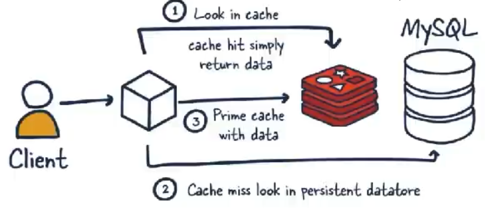
   * 对比传统数据库（MySQL）
     * Redis是key-value数据库的一种，MySQL是关系型数据库
     * Redis数据操作主要在内存，MySQL主要存储在磁盘
     * Redis在某一场景使用要优于MySQL
     * 两者并不是竞争与相互替换的关系，而是共用和配合使用

2. 内存存储和持久化
   * 支持异步将内存中的数据写到硬盘上，同时不影响继续服务
3. 高可用架构搭配
   * 单机、主从、哨兵、集群
4. 缓存穿透、击穿、雪崩
5. 分布式锁
6. 队列
   * Redis提供list和set操作，使得Redis能作为一个很好的消息队列平台使用
   * 可以应用于秒杀等
7. 排行榜+点赞

## 总体功能概述：
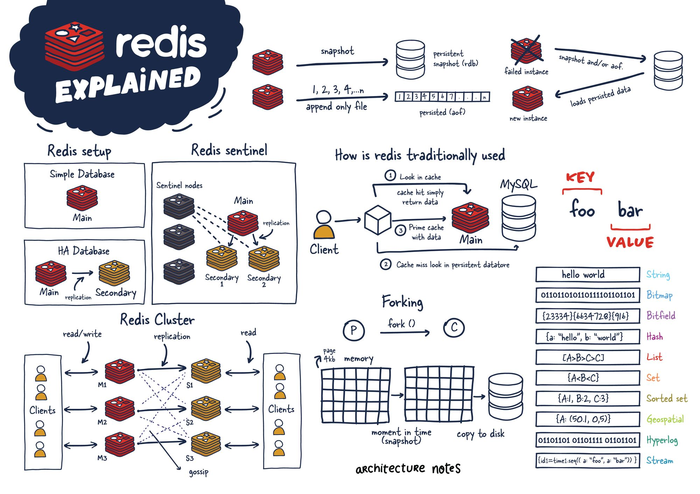
### 优势：
* 性能极高-Redis读的速度是110000次/秒，写的速度是81000次/秒
* Redis数据类型丰富，不仅仅支持简单的Key-Value类型的数据，同时还提供list，set，zset，hash等数据结构的存储
* Redis支持数据的持久化，可以将内存中的数据保持在磁盘中，重启的时候可以再次加载进行使用
* Redis支持数据的备份，即master-slave模式的数据备份

### 命令参考：http://doc.redisfans.com/

# Redis使用
## 安装环境要求和准备
* 必须是64位linux系统
* 需要有gcc编译环境
* Redis版本必须为6.0.8及以上
### 操作步骤
1. 查看linux系统操作位数  ``` getconf LONG_BIT```
2. 安装gcc编译环境 ```yum -y install gcc-c++```
3. 将Redis安装包上传至linux中的opt目录下
4. 解压 ```tar -zxvf redis-7.2.4.tar.gz```
5. 进入对应路径 ```cd /opt/redis-7.2.4```
6. 安装插件 ```make && make install```
7. 查看默认安装路径 ```cd /usr/local/bin``` ```ll```
   * redis-benchmark:性能测试工具 
   * redis-check-aof:修复有问题的AOF文件
   * redis-check-dump:修复有问题的dump.rdb文件
   * **redis-cil: 客户端，操作入口**
   * redis-sentinel:redis集群使用
   * **redis-server: Redis服务启动命令**
8. 备份redis.conf ```mkdir /myredis``` ```cp redis.conf /myredis/redis7.conf```
9. 修改原redis.conf ```vim /opt/redis-7.2.4/redis.conf ```
   * 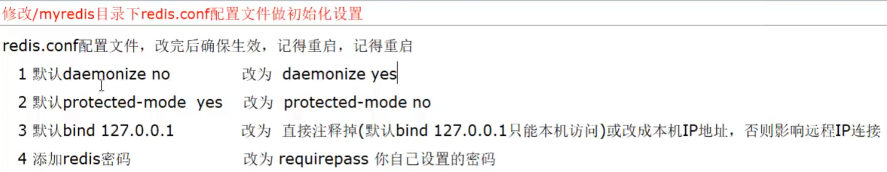
10. 启动服务 ```redis-server /opt/redis-7.2.4/redis.conf```
11. 连接服务 ```redis-cli -a 123 -p 6379```

关闭服务器： 
*   单实例关闭：在Redis服务器外面关闭命令：redis-cli -a 123456 shutdown，如果在Redis服务器里面可以直接使用shutdown命令

多实例关闭，指定端口关闭：redis-cli -p 6379 shutdown

## Redis十大数据类型
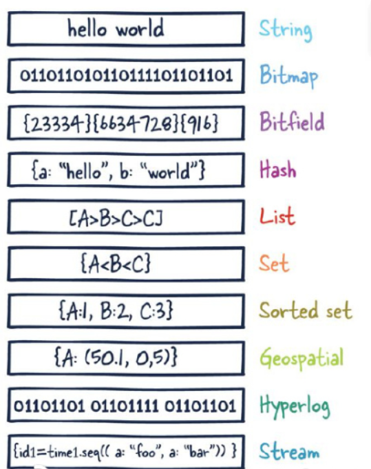

* 提前声明： 这里说的数据类型是value的数据类型，key的类型都是字符串

### redis字符串（String）
* string是redis最基本的类型，一个key对应一个value
* string类型是二进制安全的，redis的string可以包含任何数据，比如图片或者序序列化的对象
* 一个redis字符串value最多可以是512M
### redis列表（List）
* Redis列表是最简单的字符串列表，按照插入顺序排序。
* 头尾都可以添加元素，最多可以包含2^32-1个元素 
### redis哈希表（Hash）
* Redis hash是一个String类型的field（字段）格合value（值）的映射表，hash特别适合存储对象
* 每个可以存除 2^32-1键值对
### redis集合（Set）
* Redis的set是String类型的**无序集合。集合成员是唯一的，这就意味着集合中不能出现重复的数据**，集合对象的编码可以是intset或者是hashtable
* Redis中set集合是通过哈希表实现的，所以添加，删除，查找的复杂度都是O（1）
* 最大成员数 2^32-1
### redis有序集合（zSet）
* zSet和set一样，都是String类型元素的集合
* 每个zSet元素都包含一个double类型的数据
* zSet结合通过哈希表实现，添加删除，查找的复杂都是o（1）
### redis地理空间（GEO） 
* Redis GEO主要用于存储地理位置信息，并对存储的信息进行操作，包括：
* 添加、获取地理位置的坐标。
* 计算两个位置之间的距离。
* 根据用户给定的经纬度坐标来获取指定范围内的地址位置集合。
### 基数统计（HyperLogLog）
* HyperLogLog是用来做基数统计的算法，HyperLogLog的优点是，在输入元素的数量或者体积非常非常大时，计算基数所需要的空间总是固定且是很小的。
* 在Redis里面，每个HyperLogLog键只需要花费12KB内存，就可以计算接近2^64个不同元素的基数。这和计算基数时，元素越多耗费内存就越多的集合形成鲜明对比。
* 但是，因为HyperLogLog只会根据输入元素来计算基数，而不会存储输入元素本身，所以HyperLogLog不能像集合那样，返回输入的各个元素。
### redis位图（bitmap）
* 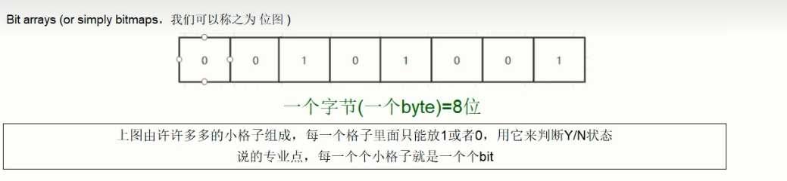
* 由0和1状态表现的二进制位的bit数组
### redis位域（bitfield）
* 通过bitfield命令可以一次性操作多个比特位域(指的是连续的多个比特位），它会执行一系列操作并返回一个响应数组，这个数组中的元素对应参数列表中的相应的执行结果。
* 说白了就是通过bitfield命令我们可以一次性对多个比特位域进行操作。
### redis流（Stream）
* Redis Stream是Redis5.0版本新增加的数据结构。
* Redis Stream主要用于消息队列（MQ，Message Queue），Redis本身就是一个Redis发布订阅（pub/sub）来实现消息队列的功能，但它有个缺点就是消息无法持久化，如果出现网络断开、Redis宕机等，消息就会被丢弃。
* 简单来说发布订阅（pub/sub）可以分发消息，但无法记录历史消息。
* 而Redis Stream提供了消息的持久化和主备复制功能，可以让任何客户端访问任何时刻的数据，并且能记住每一个客户端的访问位置，还能保证消息不丢失。
## Redis 键（key）
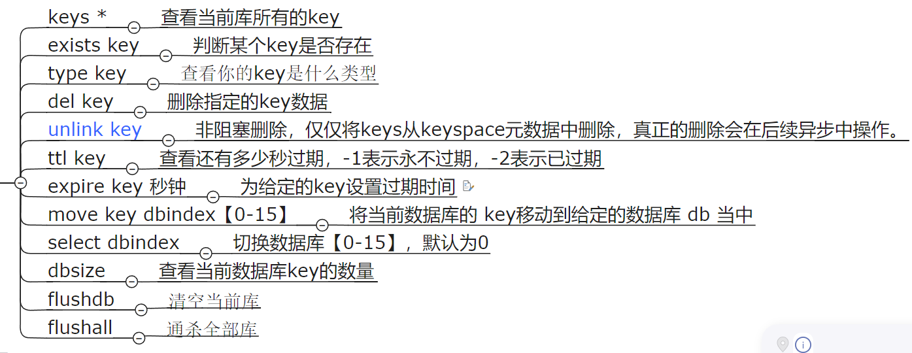

## 数据类型命令及落地使用
命令不区分大小写，key区分大小写

## Redis持久化
基本上有两种方法：
RDB AOF
### RDB：
RDB（redis数据库）：RDB持久性以指定的时间间隔执行数据集的时间点快照 \
即将某一时刻的数据和状态**全部**以文件的形式写道磁盘上，也就是快照（**全量快照**），这样一来即使故障宕机，快照文件也不是丢失，数据的可靠性也就得到了保证
这个快照文件就成问RDB文件（dump.rdb），其中，RDB就是Redis DataBasa的缩写。
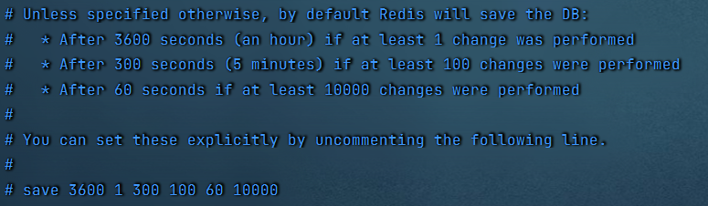
* 将备份文件(dump.rdb)移动到redis安装目录并启动服务即可恢复
* 备份成功后故意用flushdb清空redis，看看是否可以恢复数据【使用flushdb后也会空备份文件】
* 物理恢复，一定服务和备份分机隔离

手动保存有两个命令 save和 bgsave
* 生产中不允许使用save ，会导致redis阻塞

#### RDB优点：
* 适合大规模的数据恢复
* 按照业务定时备份
* 对数据完整性和一致性要求不高
* RDB文件在内存中加载速度快

#### RDB缺点：
* 有概率丢失最新的数据（未达到自动保存条件）
* 全量同步I/O影响服务器性能
* 高频次主程序fork可能会导致服务延迟

#### 哪些情况会触发RDB快照
* 配置文件中默认的快照设置
* 手动save/bgsave命令
* 执行flushall/flushdb命令
* 执行shutdown且没有开启AOF持久化
* 主从复制，主节点自动触发

#### 如何禁用快照
* 动态停止所有RDB保存规则的方法： ```redis-cli config set save```
* 修改配置文件``` save "" ```

### AOF
Aof保存的是appendonly.aof 文件 会记录之前的每一次写操作，当需要数据恢复时，会将这些操作语句再次执行，以此来达到数据恢复的目的

#### AOF持久化工作流程
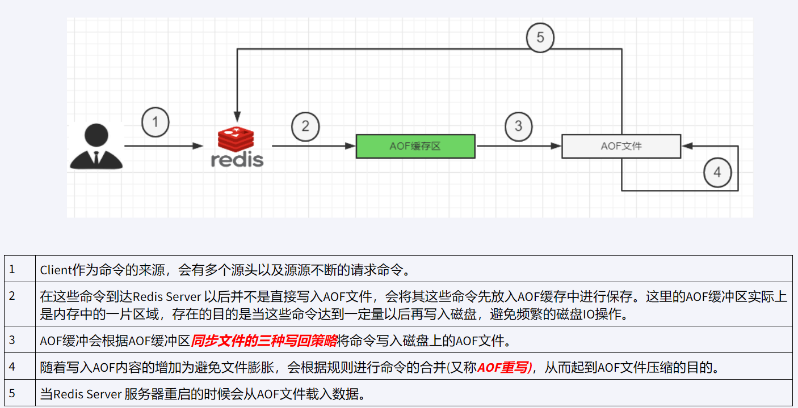

三种写回策略：
1. always ： 同步写回，每个写命令执行完立刻同步地将日志写回磁盘
2. everysec（默认） ： 每秒写回，每个写命令执行完，只是先把日志写到AOF文件的内存缓冲区，每隔一秒把缓冲区的内容写入到磁盘中
3. no ： 操作系统控制的写回，每个写命令执行完，只是先把日志写到AOF文件的内存缓冲区，由操作系统决定何时将缓冲区内容写回磁盘

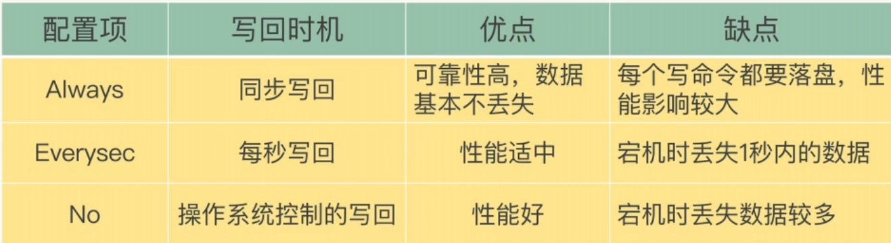

#### AOF异常恢复
正常恢复跟RDB差不多
异常恢复中模拟网络突然中断，AOF文件写入错误
此时无法进入服务器，需要修复AOF文件。   
```shell
redis-check-aof --fix *
# 此处的 * 替换为需要修复的文件名
# 一般为 appendonly.aof.1.incr.aof
```

#### AOF 优点：
* AOF更加持久，可以有不同的fsync策略，使用默认的fsync策略，最多会丢失1s的写入
* AOF日志是一个附加日志，不会出现寻道问题，不会在断电的时候损坏，并且有工具可以自动修复
* AOF太大时，redis后台可以自动重写AOF
* 包含所有的操作日志，如果使用期间使用了flushall命令，只要在此期间log没有进行重写，仍然可以通过删除最新命令来还原Redis数据集

#### AOF 缺点：
* AOF通常比等效的RDB文件大
* AOF比RDB慢  

#### 重写机制：
AOF文件越大，占用服务器空间越大，恢复时间越长

为了解决这个问题，redis引入了重写机制，当AOF文件大小超过峰值的时候，redis就会自动开启AOF内容压缩，只保留可以恢复数据的最小数据集

或者可以使用 *bgrewriteaof* 来主动重写

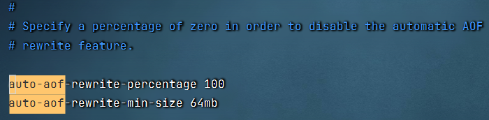

结论： AOF文件重写并不是对源文件的整理，而是读取服务器现有键值对，用一条命令去代替之前记录的多条命令，生成一个新的文件去替换原来的AOF文件

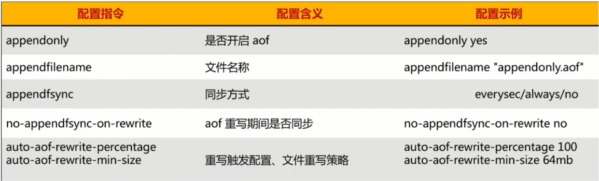

### RDB-AOF混合持久化
 可以共存，优先使用AOF
 
#### 加载顺序
如果同时开启RDB和AOF，重启时只会加载aof文件，不会加载rdb文件

#### 如何选择
通常情况下 AOF 比 RDB 数据更完整（最多丢失1s的数据）

但是不推荐只使用AOF，因为要防止AOF重写导致的问题，使用RDB保险一些

#### 如何使用 RDB+AOF混合模式
1. 混合方式设置
设置aof-use-rdb-preamble 的值为yes
2. 混合方式：RDB做全量 AOF做增量
先使用RDB进行快照存储，然后使用AOf持久化和记录所有的写操作，当重写策略满足或手动触发重写的时候，讲座心得数据存储为新的RDB记录。
这样再重启服务的时候，会从RDB和AOF两部分来恢复数据，及保存了完整性，又提高了数据的性能。

### 纯缓存模式：
同时关闭RDB+AOF
```save ""``` 禁用RDB 但仍可以使用save命令 bgsave命令生成RDB文件

```appendonly no``` 禁用AOF 仍可以使用bgrewriteaof生成AOF文件

目的：只让redis作为高速缓存功能，不使用其自身进行持久化

## redis 事务
### 是什么
可以一次执行多个命令，本质上是一组命令的集合，一个事务中的所有命令都会序列化，**按照顺序的串行化执行而不会被其他命令插入**

### 能干嘛
一次性，顺序性，排他性的执行一系列命令

### Redis事务 与 MySQL事务
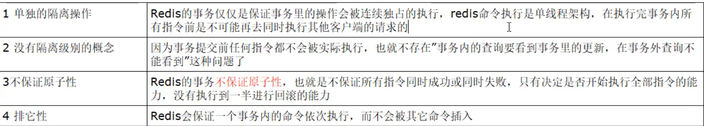